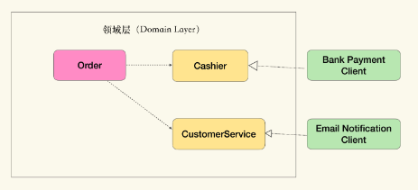
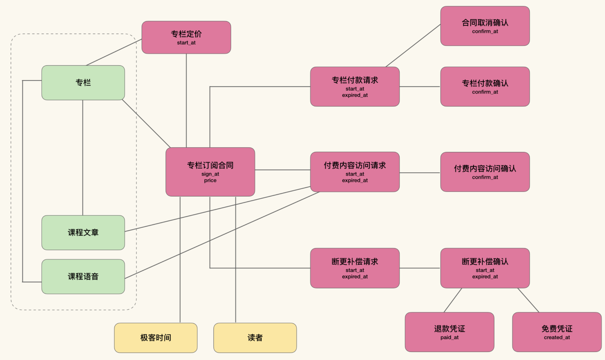

> Key of DDD:
> 
> Iterative model driven design and cooperative working style.
> 
> 1. Consistency 1: model should be consistent with code implementation
> 
> 2. Consistency 2: model should be consistent with ubiquitous language.
> 
> 3. Cycle: the model should be iteratively improved while the above two consistency maintained always. 

DDD is in fact a kind of model driven design. Identify and design the **model first**, then use this model to communicate (ubiquitous language), to guide code implementation.  

The model and the two consistencies are so important, because that the model is the abstract understanding of the business, and in this way, the business members can align ideas with developers not by verbose documents and languages, but by concise fat model. As a result, it mitigates the misunderstanding and information hiding among different members.

What does the model look like? See [Model Comprehension](#Model-Comprehension).

Model is so important but it can't be perfect from the beginning. So **iterative improvement** is a must process, just like refactoring. However, to support continuous modification, the maintainance of above association with ubiquitous language and code implementation is a must and a pain point, and vice versa. How to ease the **mutual** maintainance work? ----- The model must be simple, as [fat model](#Fat-Model) said.

And the two consistency and the iterative improvement must show in the whole development process rather than just be a saying. For example, for each iteration:

1. In IPM, before BAs dive into the details of user stories, the updated fat model should be explained first.

2. Developers should periodically check the consistency between implementation and model, either by automatical tool or mannual.

# Model Comprehension

Model contains some nodes (entity, value object, service) and relations (aggregation and association). Both nodes and relations imply business logic. 

For example, *a user can lend books*. 

Here, user and books are the obvious entities, and borrowing, the activity is also a kind of entity. They are all business objects. However separately, they are just business objects. The whole business logic '*a user can lend books*' is only expressed by the aggregation relation between user and borrowing, and the association relation between borrowing and books (the different relation type is because that user is the subject while book is the object).


Totally understand the model, can help to implement the corresponding code naturally and easily. 

## Fat Model

However, model is not enough to communicate.

Ubiquitous language is not the model itself, since for business members, it's hard to express a software by model. And some information cannot be expressed by model, e.g. product prospect. However, if we need to document this, it's hard to maintain. And when we use this language, the business people won't use model anymore, and the model is as a result just for the developer. Thus, I think that model should be the core of the ubiquitous language, and add some missed information when necessary, while all these information should be kept together with the model, which can make sure the center status of model. Any way, with the new fat model, we should be able to tell the whole business story. For this fat model, it should contains:

1. definition of each domain object (entity, value object, service)

2. business rules. They should be simple and cannot contain anything without any reflection in model. Complex details should be described in user stories or other media. Thus, here business rules seem to be more like features.

3. bounded context, e.g. service name, service prospect, etc.

4. model it self

The fat model must be simple so that it's easy to maintain and understand.

The following role-target-entity table can be used in the fat model. We can even add the restful api in this table.


## Ubiquitous Language


# Implementation Consistency

During implementation, sometimes it's hard to keep consistent with the model. For example, for association in model, we often implement it as a collection object on the aggregation root; for one entity used in different context, that entity will be very big, etc.

To solve these problem, we need to **explictly model** those elements(association, boundedContext...) in the model.

## Association Object

When implementing the domain model, especially the aggregation concept, performance or logic leaking issues often emerged. 

For example, for the `User` entity, to get all the borrowings, we in fact needed to get the data from database. If we firstly load all data into the memory, and then operate like collection, it may be slow and sometimes impossible. However, if we add another class to do this directly instead of accessing borrowings from `User`, logic is leaked.

The reason is that when talking about model, the collection and database seem to be the same, while in fact, they're not. This misunderstanding is from smalltalk, almost the first object-oriented language/database/model. And the object-oriented design is developed from smalltalk. However, smalltalk is a monolithic architecture and all collections are in fact persisted in local storage, which makes the collections the same as the database. In object-oriented design, the difference between collection and database is neglected, too. However, model multi-layered architecture almost always separate application and database. The difference between collection and database cannot be neglected now.

Thus, we should explicitly model this collection relationship now, by using the association object.

```java
public interface MySubscriptions extends Iterable<Subscription> {
   List<Subscription> subList(int from, int to); //分页
   double getTotalSubscriptionFee(); //获取总共花费
   int count(); //获取总订阅数
   Iterable<Subscription> sort(...);
   ....
}


public class MySubscriptionsAPI implements MySubscriptions {
  ...
  private User user;


  public List<Subscription> subList(int from, int to) {
    return client.findSubscriptions(....);
  }
  ...
}


public class User {
  private MySubscriptions mySubscriptions;

  public MySubscriptions getMySubscriptions() {
     return mySubscriptions
  }
}


public class Column {


    public static interface MyReaders extends Iterable<Subscription> {
    ...
    }

    private MyReaders myReaders；


    ..


}
```

## BoundedContext Object & Role Object


User shows in multiple contexts which make User class very big and heavy. This is obviously a bad smell.

```java
public class User {
    private long id;

    // 社交上下文
    private List<Friendship> friends;
    private List<Moments> moments;

    // 订阅上下文
    private List<Subscription> subscriptions;

    // 订单上下文
    private List<Order> orders;
    private List<Payment> payments;

    // 社交上下文
    public void make(Friendship friend) {
      ...
    }

    public void break(Friendship friend) {
      ...
    }

    // 订单上下文
    public void placeOrder(Column column) {
      ...
    }    

    // 订阅上下文
    public boolean canView(Content content) {
      ...
    }        
}      
```

Instead, the user in different context shows as different roles. We explictly model the roles.


And instead of aggregating the objects to entity, now we aggregate all the objects to the corresponding context. And each context can thus have their own implementation (db/http...).

Even when the different contexts are implemented as different microservices, with few code change and still having these different role objects and context objects, we can still keep consistent with the model and encapsulate the business logic.

```java
interface SubscriptionContext {
    interface Reader {
        boolean canView(Content content);    
    }

    Reader asReader(User user);
}


interface SocialContext {
    interface Contact {
        void make(Friendship friend);
        void break(Friendship friend);
    }

    Contact asContact(User user);
}


interface OrderContext {
    interface Buyer {
        void placeOrder(Column column);        
    }

    Buyer asBuyer(User user);

}


interface UserRepository {
    User findUserById(long id);

    SubscriptionContext inSubscriptionContext();
    SocialContext inSocialContext();
    OrderContext inOrderContext();
}


public class UserRepositoryDB {
    //通过依赖注入获取不同的上下文对象
    @Inject private SubscriptionContext subscriptionContext;     

    @Inject private SocialContext socialContext;

    @Inject private OrderContext orderContext;

    ...
}

// 最后的使用方式就成了：

UserRepository users = ....;


User user = users.findUserById(...);


Buyer buyer = users.inOrderContext().asBuyer(user);
Reader reader = users.inSubscriptionContext().asReader(user);
Contact contact = users.inSocialContext().asContact(user);
```

## Capability Provider Object

Sometimes, in implementation, we use some technical components in the domain model, but those technical components are not extracted in the model, and they're often more easier to change. Often, we will find a real world object who will provide the service provided by the technical components. Thus we can explicitly model these objects as capability provider. This is also the case that the technical people supplement the model from technical view.

These capability providers are defined as interface, to segragate the volatile implementation details.



```java
//领域层内
interface Cashier {
    ...
}

interface CustomerService {
    ...
}

public class Order {

    public void pay(Cashier cashier, CustomerService staff) {
        try {
            Payment payment = cashier.collect(...);
            payments.add(payment);
            staff.tell(owner, ..);
        } catch(....) {
            staff.tell(owner, ..);
        }
    }
}

//领域层外
public class BankPaymentCahsier extends BankPaymentClient implements Cashier {
    ...
}

public class EmailCustomerService extends EmailNotificationClient implements CustomerService {
```

# How to Design

## User Journey

User journey is a great way to explore the business and extracts all the entities envloved in each interaction step. These information can also later be recorded in the role-target-entity table.

## Event Storming

It's an event modelling method. We brain storm the events (noun + past-tense verb), then entity and other elements related.??????????? to be confirmed.

## Four-color Modelling

The above 2 are both very divergent.

## 8x Flow

在所有的业务逻辑中，**<u>权责履约是最小的业务交互，合同是最小的业务上下文</u>**。那么我们就能使用权责和合同上下文对业务进行建模了。

针对每一个权责履约，实际是在业务上定义了一小段时间线，从履约请求开始，到履约确认为止

我们可以将合同上下文看做两个角色间业务交互的证据的聚合。这是一种业务上存在的聚合关系，是一种比对象聚合更具有业务含义的包含关系。

通过 Request-Confirmation 表示的履约结构是一种异步结构：在规定时限内，未得到确认之前，履约处在未知状态。这种异步并不是技术上的刻意选择，而是业务的真实状态。

合同上下文并不是弹性边界，**<u>履约上下文才是弹性边界</u>**。此外，由于我们分离了领域逻辑和业务逻辑，那么 **<u>领域逻辑也是弹性边界</u>**。在领域逻辑中，数据一致性为主导；而在业务逻辑中，是合同上下文中对业务逻辑的聚合为主导。合同上下文中的业务一致性，也就是履约与违约构成的一致性，因而业务逻辑的弹性改变并不会影响领域逻辑。

8X Flow 的元模型（Meta Model）图:


使用 8X Flow 建模的流程大致是这样的：

1. 寻找合同上下文，明确合同的参与方；

2. 寻找合同中的主要履约项，按四色建模寻找凭证；

3. 对于主要履约项，寻找违约情况，设立新履约项，按四色建模寻找凭证；

4. 重复步骤 3，直到不得不打官司为止；

5. 将参与方和标的物划分入领域边界。

### 极客时间专栏（example）

首先来看一下读者侧，合同是非常明确的，即专栏订阅合同。参与方就是读者和极客时间。

然后，我们来看看主要履约项：

1. 支付订阅费用，权利方是极客时间，义务方是读者。

2. 访问付费内容，权利方是读者，义务方是极客时间。

那么我们可以建立一个业务模型，里面包含合同和这两个主要履约项：


对应上面讲的两个权责，那么分别存在如下两种违约情况：

1. 未在规定时间内完成支付，那么合同自动作废，读者并不承担额外责任。权利方是极客时间，义务方是读者。

2. 如果专栏出现断更，没能按说明提供内容，专栏下架，极客时间退钱，并且在下次同专栏上架时，不再向原读者收取任何费用。权利方是读者，义务方是极客时间。

对于第一项违约，合同作废是自动行为，不需要义务方确认，所以不需要有独立的权责项，也没有后续继续违约的操作了。对于第二项违约，如果极客时间拒不退钱，那么读者也只能走法律手段了。这就已经触碰到需要走法律程序的边界了，那我们就不需要继续寻找违约项了。



### Microservices

理论上讲，每个不同履约项都可能具有不同的弹性边界，而以履约项为单位拆分成细小的服务，仍然可以表示业务能力。然而我会建议你，**<u>从合同上下文开始，先将不同的合同上下文作为服务边界，然后再看看是否需要将履约项拆分成独立的服务。</u>** 并不需要把每一个履约项拆分成独立的服务，这样不一定有什么好处。只有在履约项真的需要独立的弹性边界时，才需要这么做。
