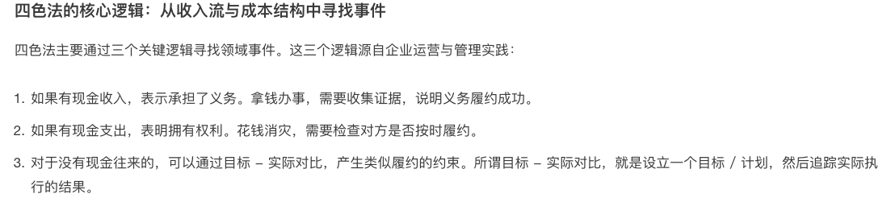
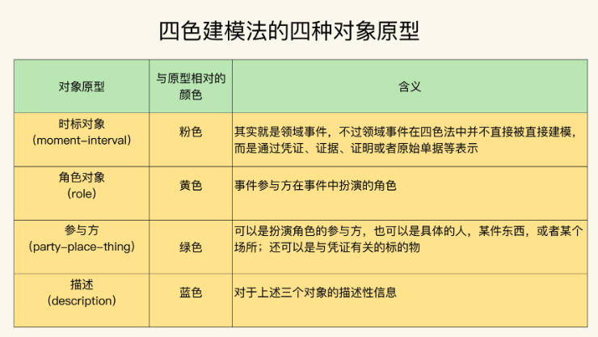
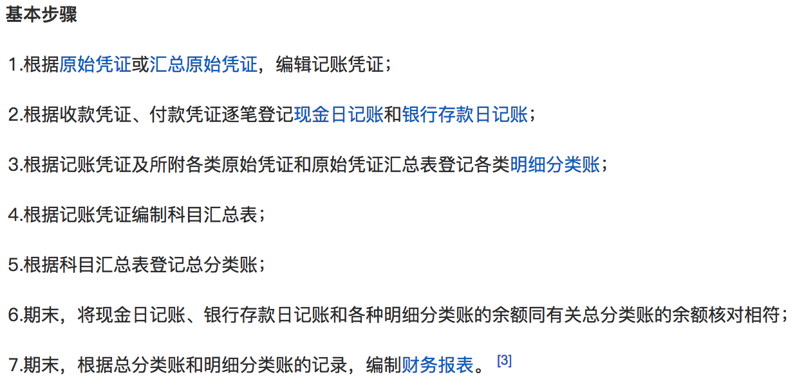

参考：

- [运用四色建模方法进行领域分析](http://www.infoq.com/cn/articles/xh-four-color-modeling/)

# 1. 关键词

1. 极端场景  

2. 业务事件的发生必然会有凭证的形式保存下来，对事件的追溯可以通过对这些凭证（数据）的追溯来完成（对时间追溯，其实就是构建了一个result，然后利用这些凭证去审查这个过程的结果是不是result，即会计、审计要做的工作）  

3. 对于任何一笔正常的经济往来，都需要知道：  
   
   1. 如果我付出一笔资金，那么我的权益是什么？  
   
   2. 如果我收到一笔资金，那么我的义务是什么？  

4. 为此，需要知道：  
   
   1. 哪些事件在运营上是需要追溯的？凭证是关键流程/业务的执行结果，而所谓的流程/业务，其实就是功能/需求嘛，等于说先列出需求点，然后再从中找出在运营中需要追溯的业务需求。  
   
   2. 这些事件留下了什么足迹

# 2. 流程

1. 事件：以满足**管理和运营**为前提，抽象核心业务。可有首先列举业务，然后在抽核心业务。而所谓业务其实就是需求，所以首先需要列需求，从中抽核心业务。
   
   1. 例如滴滴，两个核心业务，乘客付钱，钱打给滴滴司机。
   
   2. 例如库存管理系统，两个重要时间点，入库，出库。
   
   3. 例如京东自营，两个重要时间点，客户付钱给平台，平台退钱给客户

2. 时标性对象（moment-interval对象，红卡）：业务结果（行为的结果）。即上述核心业务的执行结果，一般是表示经济业务已经发生、执行或完成的原始凭证（常见类型见下文介绍），用以明确经济责任。首先识别上述核心业务节点的时标性对象。所谓时标性对象，首先有一个默认属性是时间，即这个对象在每个时间点状态是不一样的，或者说它的时间点是很重要的。识别到节点时标性对象后，识别它的关键属性，根据其关键属性的构造，向上追溯其它时标性对象。可用于追溯的关键属性一般有：**金额、数量、单价、计量单位**。
   
   1. 时标性对象常见的有三类：capital（即代表了资产例如payment之类的）、fullfillment（代表某个操作的完成，例如confirmation之类的）、aggrement（代表某个时刻达成的协议，例如contract）
   
   2. 例如滴滴中，乘客付钱时的时标性对象是orderPayment（其关键属性price=order price - coupon）。其中order price是从order中的price来（order price = unit price * mileages）。unit price可能是某个时间点司机输入的（unit price与司机的location是相关的），也可能是系统根据order type自动计算的，这里不再展开。然后mileages是用户的一个journey的属性（mileages ＝ end－start），这个journey是根据用户的request得到的（start，end），

3. 人、地、物（绿卡）：识别角色等内容后，抽象出这些人地物。－－－原始凭证（时标性对象）有一些基本内容，除了时间、金额等作为追溯用的关键属性，还有其他如**填制凭证单位名称、接收凭证（人）单位名称、原始凭证名称（物）、经办业务部门（地）**这些基本内容。这些内容因为一般是独立的个体，可以识别为一些实体。

4. 角色（黄卡）：原始凭证中，如果有需要，还有一些基本内容：**填制人、经办人**。

5. descrption（蓝卡）：原始凭证中，还有一些基本内容：**摘要**。

6. 评价一个模型：
   
   1. 从审计的角度评价一个模型。最终目标是审计。如果我们按应用分层推进的方式来解释，那么最底层的sor它应该表示企业核心业务运营系统，即记录财政的整个流程（企业是为了赚钱嘛），这个流程最终要支持审计工作，而domain events（在这里其实是mi对象）提供这整个流程的可追踪性。因此按这种方法，从企业运营角度建模时，要识别在审计中需要的那些关键追踪对象。然后再加上其他色块，使得整个模型的表述更清晰完整。
   
   2. 构建一个需要走完整审计流程的场景（一般是极端场景），然后查目前的模型能否支持审计工作

# 3. 审计：

1. 对象：经济活动和经济现象。  

2. 目的：形成对经济活动的合法合规性或有效性及经济现象（如会计资料）的真实公允性的一种看法。  

3. 手段：收集和评估审计证据。即能够达到上述目的的证据。审计的一个前提和基础是会计资料，因此，  
   
   1. domain model的一个主要工作是[登记账簿](http://baike.baidu.com/view/595480.htm)。它以会计凭证为依据，将分散的会计凭证上的资料进行整理、定期汇总，然后用于编制[会计报表](http://baike.baidu.com/view/76200.htm)（也称为[财务报表](http://baike.baidu.com/view/436886.htm)），是传递会计信息和审计的主要依据：  
      
      1. 内容：日期（记账凭证的日期）、凭证编号、摘要、**金额**等，在具体的会计凭证中还要记录**数量、计量单位、单价**、填制凭证单位名称、接受凭证单位名称、经办人等（加粗部分一般是可追踪的时标对象的关键属性，其他用于抽象人地物－绿块，角色－黄块，描述－蓝块）
      
      2. 
      
      3. 账簿分类（可能的时标对象）：  
         
         1. 现金日记账/银行存款日记账：依据－－收款凭证（收据）、付款凭证（例如银行卡付款凭据）。  
         
         2. 总分类账：依据－－记账凭证／科目汇总表（即记账凭证汇总表）/其他方式  
         
         3. 明细分类账：依据－－原始凭证、记账凭证  
      
      4. 保证账簿的持久性，防止涂改（时标对象不能有put）  
      
      5. 连续登记，不得跳页、隔行。如有需要，应加盖戳记并签章。（时标对象不能有delete）  
      
      6. 余额结计。需要结出余额的账户，应记录余额、余额方向（借、贷、平）（这是一项工作，是基于账簿做的一项操作，仅是每个账簿中的一个条目，并不单独做为一张报表存在，即balance不是时标对象，是一个基于时标对象的的计算操作，并最终作为时标对象的属性保存）  
      
      7. 定期打印（上述时标对象什么时候应该被保存）  
   
   2. [会计凭证](http://baike.baidu.com/view/264931.htm)：是记录经济业务**发生或完成情况**的书面证明，是记录经济信息的载体。这是基本时标对象，账簿是基于这些时标对象进行汇总的另一类时标对象（因为账簿也有记录时间和周期，所以也是时标对象）。分为两类：  
      
      1. [原始凭证](http://baike.baidu.com/view/95261.htm)：即单据，是经济业务**已经发生、执行或完成**填制的原始书面证明（申请单等不能证明业务发生、完成情况等单证不能作为原始凭证），用以明确经济责任，它是业务发生过程中直接产生的（模型中的主要时标对象）。可分为两类：
         
         1. 自制原始凭证：经办人员自行填制，仅供内部人员使用的。由分为（1）一次凭证（eg. 领料单、收料单、产品入库单、报销凭单（例如我们报销填的report、order等）、职工借款单等。）；（2）累计凭证（eg. 限额领料单，其时间属性是周期，到期末填制手续才算完成）；（3）汇总原始凭证（eg. 发料凭证汇总表、收料凭证汇总表、现金收入汇总表）；（4）记账编制凭证（eg. 制造费用分配表、定价单、工资费用分配单、折旧计算表），根据账簿记录和经济业务的需要，对某一特定事项进行分类、整理而编制的凭证。
         
         2. 外来原始凭证：同外单位发生经济关系时，从外单位取得的凭证，都是一次凭证。eg. 发货票、发票、收据、车船票、退货发票、退货验收证明、银行首付款  
         
         3. 注意：
            
            1. 要证明支付，要以支付凭证、收款凭证作为原始凭证）
            
            2. 退货退款，要以退货发票、退货验收证明、收款收据作为原始凭证
      
      2. 记账凭证：以审核无误的原始凭证为依据，并加以归类处理后的会计凭证，是登记账簿的直接依据（原始凭证一般作为记账凭证的附件，有时也是记录明细账户的依据）。在账簿中对该记账凭证登记完成之后，应该在凭证的“过帐栏”内做标记，表示记账完毕。分为专用记账凭证（收款凭证、付款凭证、转账凭证）和通用记账凭证。  
      
      3. 区别：
      
      4.   
   
   3. 记账流程（参考[科目汇总表](http://baike.baidu.com/view/648336.htm)）：
   
   4. 

# 4. 问题：

1. 时标性对象那三类，不是很理解？

2. 感觉理解了，但是总结的不完全。还是直接按照原始凭证的定义去找时标性对象更容易些。

3. 不应该从审计角度，而是从会计角度出发评价一个模型。会计是经营管理的主要部分，是对经营和管理过程的反映和监督，而审计则是经营管理之外，目的是经济监督。会计的对象是资金运动过程，是经济活动价值方面（这与讲述的流程是一致的）；而审计对象是会计资料和其他经济信息所反应的经济活动。而我们的时标追踪目前主要针对的是会计资料吧，而且更多的是为了一种自我监督，所以应该是从会计角度出发。但会计资料是审计的前提和基础，所以如果非要说是从审计角度出发，先收集会计资料，那么就忽略了其他经济信息所反应的经济活动，所以从目前来说，应该是从会计角度出发吧？

4. 应该主要是从会计角度出发的。主要目的应该是用电子化方式记录会计凭证（主要是原始凭证），这个凭证可以用于会计，可以用于审计。

5. 登记账簿时为什么要连续登记？

6. 应该强调的是不能删。场景：如果某个账你写错了，你不能把这一页撕了，当作没写过，而是给它加盖个戳，然后接着下一个编号或下一页写。

7. 记录凭证是什么？因为按目前的理解，时标对象可以有基本时标对象和复合时标对象（账簿：总分类账，明细账，现金日记账、存款日记账）。基本时标对象有原始凭证（单据），应该也有记录凭证，但是记录凭证是什么样，可能有哪些时标对象的例子呢？

8. 记录凭证应该就是在原始凭证和账簿之间加了一层，增加对货币资金对管理和监督。也就是在做会计和审计时，需要先把原始凭证加工一下，弄成会计界的通用语言，然后再做后续的分析监督。所以它仅仅是进入会计这个领域才会使用的东西，对于我们一般的建模，时标对象应该主要是原始凭证（包括原始凭证的汇总）

9. 现金日记账和银行存款日记账到底是啥意思？形成的报表是什么样子？（因为mi对象都可以看成是一张张报表）

10. 就是每天的账单。现金日记账登记库存现金每天的收入，银行存款日记账登记每天银行收支业务。

11. 如何表达对某类对象的抽象？
