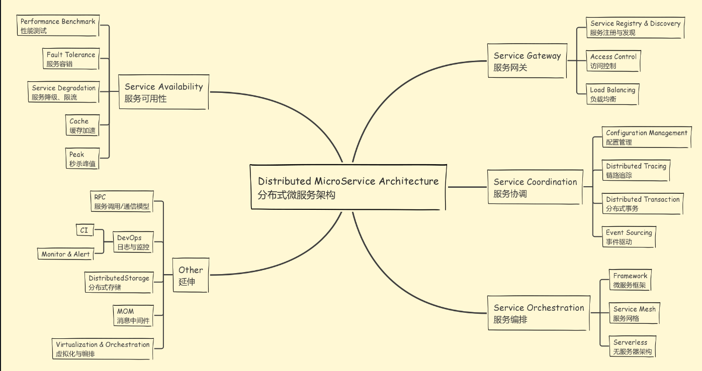
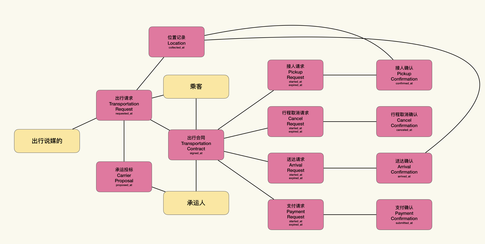
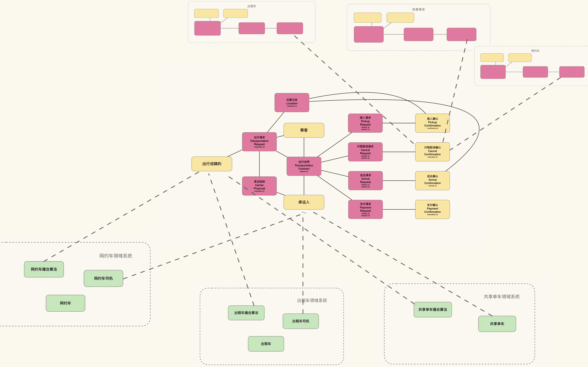

> 为什么 RESTful API 最终还是成为“行业主流”了呢（虽然真的会，和真的用的人并不多）？***因为从大趋势上来说，将企业内的能力（而不仅仅是后台）构造成开放 API，并围绕着开放 API，形成企业内生态是大势。在这个大势之下，RESTful API、MicroService、企业内生态、能力平台、中台形成了一条清晰的企业架构现代化之路***。仅仅服务于某些（或者某个）前台的后台服务，终将会淡出历史的舞台。

# What's Microservice

在 James Lewis 和 Martin Fowler 的名作[《微服务》](https://www.martinfowler.com/articles/microservices.html)中，将微服务定义为一种架构风格，并总结了它的九种特质：

1. 通过服务实现组件化；

2. **<u>服务按照业务能力划分组织</u>**；

3. 服务以产品而不是项目研发；

4. 逻辑集中在服务中，编排简单；

5. 每个服务自主决策（技术栈、语言等等）；

6. 每个服务自主管理数据（不强制使用统一数据源）；

7. 基础设施自动化；

8. 将服务失败当作常态纳入设计考量；

9. 演进式设计（不求一步到位）。

# MicroServices in Cloud

## Elasticity

> 动态调节的能力被称作云的弹性，它是云平台一切美好特质的基础。
> 
> 云平台所声称的弹性，是建立在水平扩展的基础上的。于是我们可以这么说：能充分利用云平台能力的架构，就是能够充分利用水平扩展的架构。
> 
> 云平台帮我们实现了对弹性的诉求。也就是能够根据流量的改变，动态地调整所需要的基础设施。
> 
> 云原生的架构，**<u>关键在于将弹性需要不同的组件分离。</u>** 事实上，我们可以将微服务架构看作一种以业务上下文为弹性边界的云原生架构模式。也就是说，微服务是云原生架构的一个子集，或者是一种特化（specilization）的形态。
> 
> 在云平台上，弹性永远是第一优先级。**<u>如果两个上下文明显具有不同的弹性诉求，那就应该拆分。而如果具有一致的弹性诉求，就可以不拆。</u>**
> 
> 因而微服务对不同变更速度的诉求，可以看作弹性诉求，**<u>通过弹性边界去控制变更的成本</u>**。那么，我们就能用弹性优先原则去分析微服务架构，以寻找服务划分的准则了。换言之，对于以云平台为部署目标的微服务系统而言，微服务的划分要以弹性边界为主，以业务上下文为辅。这也帮我们回答了微服务架构的第一难题：微服务到底要多微？答案是，微到能够更好地利用弹性控制成本的大小。
> 
> 我们可以回想一下各种基础设施服务云平台（IaaS，Infrastructure as a Service），它们其实只有复制和剪切两个能力：根据给定镜像（Image），产生符合镜像内容的机器的能力。也就是将镜像复制为机器的能力。撤销不需要的机器，将其放回资源池的能力。也就是剪切机器的能力。

## Elasticity Dependency

> 弹性边界间的依赖（也就是服务间调用关系，或是数据交换关系），会造成流量的传递。如果上游弹性边界突然需要处理大量的流量，那么这些流量自然也会传递到下游弹性边界中。这种不同弹性边界间流量的传递称作弹性依赖（Elasticity Dependency）
> 
> 在云原生架构下，只要组件之间存在交互，弹性依赖就不可避免。只不过，**<u>云平台更擅长处理依赖于吞吐量（Thoughput）的弹性依赖</u>**，但对依赖于响应时间（Response Time）的弹性依赖，就没有什么好办法了。
> 
> 这背后的原因在于水平扩展并不能保证改进响应时间，而只能提高吞吐量。也就是说，云平台的弹性并不总能改进响应时间，但一定可以提高吞吐量。这就意味着对于吞吐量的诉求，可以通过弹性来解决。但对于响应时间的诉求，弹性可能无法处理。
> 
> **<u>弹性扩容实际上就是对吞吐量的扩容。</u>**
> 
> 通过水平扩展缩短响应时间，需要将请求转化为并行算法，从而将计算分布到不同的计算节点上。我们对 Actor 并发模型、函数式编程等新的编程范式的热情，在很大程度上，也是因为这些新的范式能够提供一定程度的自动并行优化，帮助我们缩短响应时间。
> 
> **<u>依赖于响应时间的弹性依赖，我将这类弹性依赖称为弹性耦合（Elasticity Coupling），以表示与依赖于吞吐量的弹性依赖的区别</u>**。
> 
> 我们需要尽可能地避免弹性耦合，才能充分利用云平台的能力。那么，怎么才能避免弹性耦合呢？最简单的方式，是 **<u>将组件间的同步调用模式改为异步</u>**。这是因为，服务与组件间的同步调用，会带来响应时间的依赖；而异步调用，则能将其改变为吞吐量的依赖。
> 
> 在云时代，**<u>异步调用、事件驱动架构风格会逐渐成为主流的选</u>择**。
> 
> 默认异步对业务建模的挑战:
> 
> 1. 如何将异步调用与模型结合起来？
> 
> 2. 如何处理异步调用对聚合关系一致性的影响？
> 
> 异步方式意味着，由模型产生的数据可能存在中间状态.
> 
> 一旦进入异步模式，会出现尚未确认的关联。这个问题其实不大，不过需要额外注意的是，那些在规定时间内没有得到确认的关联。
> 
> 在云原生时代，我们需要将弹性作为首要考虑的因素，纳入建模的考量。那么弹性边界，就是我们划分系统的重要依据。而且，我们还需要考虑弹性边界间的依赖关系，尽量避免弹性耦合。
> 
> 对于业务建模来说，为了配合云时代的架构约束，我们需要做到如下几点：
> 
> 1. 确立一种模型结构以反映弹性边界； 
> 
> 2. 从异步模型的视角，解读业务逻辑；
> 
> 3. 在弹性边界切分业务上下文时，维护业务一致性；
> 
> 4. 在异步调用产生中间态异常时，维护业务一致性。

### Async Call

[asyncAPI](https://www.asyncapi.com/)

# Business Modelling

business vs domain:

> 云时代架构系统中，新的技术范型带来了成本收入上的优势，业务方则为了利用这些优势，便根据这些新的技术范型，改变了业务运营方式，然后引起了背后模型的改变。**<u>云改变了成本最低的运营模式，将其从统一模式（Unification）变成了复制模式（Replication）</u>**。
> 
> 一个常用的架构模式，可以 **<u>把系统分解为两部分：与运营无关的部分；提供运营能力的部分</u>**。**<u>“领域”表示与运营无关的问题域，“业务”表示与运营相关的问题域。</u>** 业务逻辑是和某种运营方式绑定的，我们把业务逻辑的这个特性称作运营特定（Business Operation Specific）。业务逻辑一般具有运营特定和领域中立性。与之相对的，就是领域逻辑具有运营中立性和领域特定性。
> 
> 通过“两关联一循环”对业务逻辑建模的效果，要远远好于对领域逻辑的建模的效果。对于能通过面向对象模型表示核心复杂度的领域逻辑，知识消化法是能够发挥作用的。因为我们讲到现在，隐含的前提就是通过对象模型建模问题。但是，并不是所有的领域逻辑都适合使用对象模型表达。
> 
> 比如，对于类似 Google、Bing 这类搜索引擎而言，与运营无关的部分是搜索引擎，而与运营有关的则是广告的投放和竞价。对于类似优酷、爱奇艺这类视频网站而言，与运营无关的是流媒体部分，而与运营有关的则是 VIP 账户、广告等。
> 
> 业务逻辑是源自业务运营的逻辑，是领域中立且运营特定的，其复杂度来自于业务流程，关注的是如何通过某个领域逻辑实现获利。因而它的关注点，就集中在盈利和成本结构上。或者说，业务逻辑对外体现为利润或现金，对内体现为成本和绩效承诺。
> 
> 而领域逻辑源自问题域自身的逻辑，是运营中立而领域特定的，其复杂度来自于问题本身，关注点通常是算法、计划、统计、优化等等。
> 
> 所以关注业务逻辑的组件与关注领域逻辑的组件，通常具有不同的弹性边界。
> 
> 以极客时间专栏为例，在缓存策略恰当的前提下，如果读者猛增，那么对内容管理部分的弹性需求，会远远小于对业务运营部分的弹性需求。而对于搜索引擎业务来说，当搜索用户猛增时，对广告投放这部分的弹性需求，要远远小于对索引部分的弹性需求。
> 
> 因而从弹性优先的角度出发，我们应该将关注业务逻辑的组件与关注领域逻辑的组件分离。这样构建出来的模型，更能适应云时代的架构约束，也能让我们分别使用不同的建模方法，获得对应的领域模型与业务模型。

# 中台

宏流程，宏观业务模式的复用。

> 宏流程是一种宏观的抽象的流程，需要通过配置与实例化才能变成前台团队需要的具体业务流程。所以宏流程不是流程，宏流程是业务流程的模版。或者说，宏流程是一种可以在不同业务场景下复现的业务模式。
> 
> 合同履约本身就隐含了双方业务往来的流程；合同上下文中的角色是变化点，而引入变化点，就是对业务流程的泛化.
> 
> 如何从 8X Flow 的合同上下文中提取宏流程，并通过提取出的宏流程构建中台的业务模型。总结起来，大致流程是这样的：
> 
> 1. 通过 8X Flow 进行业务建模；
> 
> 2. 确定需要在不同业务场景中可复用的业务模式；
> 
> 3. 寻找到业务模式所对应的 8X Flow 合同上下文；
> 
> 4. 通过将 **<u>履约项角色化引入变化点</u>**；
> 
> 5. 在不同的业务场景下扩展替换变化点，并将它们分别放置于不同上下文中；
> 
> 6. 在不同上下文中继续 8X Flow 建模，直到可以解释清楚不同的业务上下文是如何完成对宏流程的扩展。
> 
> 在得到中台的业务模型之后，我们就可以开始着手中台的实现了。事实上，中台除了在业务建模具有挑战之外，在技术实现上也颇具难度，因而我们需要大量使用微服务和 SaaS 化架构。这也正是我们接下来两节课要讲的内容。

因而从合同出发寻找到的合同流程，实际上是业务流程的目标与模板。而业务流程，是对合同流程的实现与映射。既然合同流程是业务流程的模板，使得合同流程本身就具有一定的宏流程特点。比如，在出行合同上下文中，规定了履约项支付车费。但由于这只是在合同流程中的履约项，那么映射到业务流程中，就可以有不同的表现形式了。

所以要建模宏流程，合同流程就是一个非常好的候选和出发点。从合同流程出发，我们寻找到一个合理的流程框架，就可以在不同的业务上下文中展开或映射成不同的业务流程。

## example

以出行的合同为例，根据我们日常经验，其中权责履约项目包含：取消、接人、送达、支付。与这个合同对应的投标邀请和投标，就是出行请求和承运投标。对应的合同上下文如下图所示：

在这个合同上下文中，有两个主要的流程。第一个是乘客发出出行请求，然后平台通过“出行说媒的”这个撮合引擎的拟人化角色，匹配到对应的承运人，最后形成出行合同的过程。

从业务功能角度来说，这就是叫车的功能流程；从合同的角度来说，是签订出行合同的流程。

第二个就是出行合同签订之后的履约流程。承运人到指定地点接人，然后送达目的地，最后乘客支付费用。

从业务功能来讲，这就是乘车的功能流程。从合同的角度来看，这是合同的履约流程。

对合同流程进行必要的泛化，也就是通过角色和角色的扮演，将变化点引入到合同上下文中来。

合同上下文中的变化点与扩展点，并不仅仅是履约的确认凭证。任何角色对象，都可以看做是业务上的变化点与扩展点。但是扮演关系不一定来自另外的合同上下文，它可能来自于领域系统。

比如，在这个例子中拟人化的撮合算法出行拉媒的和承运人。

在中台化的出行模式中，不同业务场景下的承运人，实际上就是被不同的前台团队管理的不同运力资源。那么对于网约车来说，承运人就是网约车司机。对于出租车，就是出租车司机。对于共享单车，就是附近可用的共享单车。

同样，对于拟人化的撮合算法出行拉媒的，在不同的业务场景下，就表示不同的算法，或者同一算法的不同配置策略。因而我们可以将运力和算法建模为领域系统，然后通过领域系统来扮演这两个角色。

通过这张图就可以发现，在不同的业务场景下，我们对合同上下文中的变化点做了不同的配置与扩展：

* 在网约车的业务场景下，就是出行合同上下文配合网约车领域系统，支持了网约车的业务；

* 在出租车的业务场景下，就是出行合同上下文配合出租车领域系统，支持了出租车的业务。

于是我们通过配置，将同样的合同流程，具体展开成了不同的业务流程，也就达到了业务层面上模式复用的目的。

