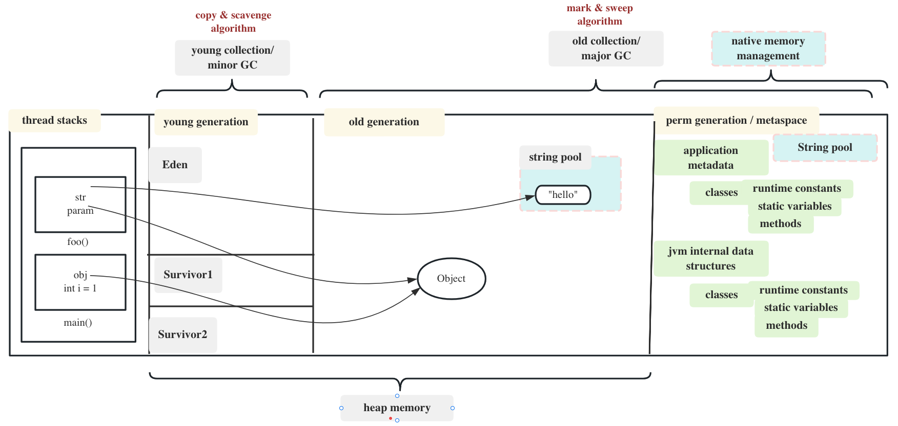
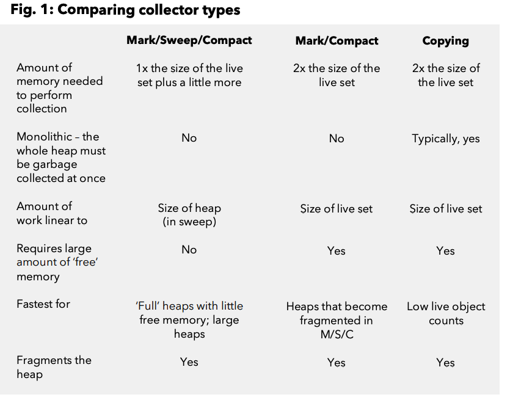
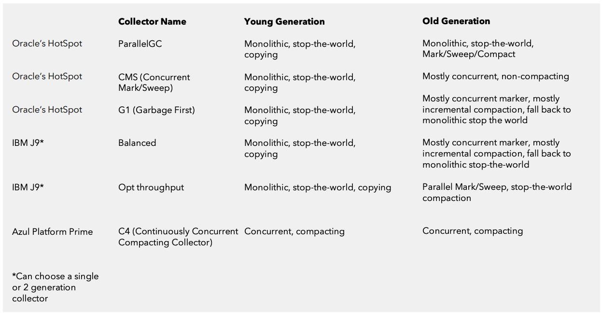

JVM is the heart of Java programming language. When we execute a Java program, JVM is responsible for converting the byte code to the machine-specific code. JVM is also platform-dependent and provides core java functions such as memory management, garbage collection, security, etc.

# Garbage Collection

In Java, a developer does not need to explicitly allocate and deallocate memory – the JVM and more specifically the Garbage Collector – has the duty of handling memory allocation so that the developer doesn't have to.

For most collectors GC related pauses are proportional to size of their heaps which is approximately 1 second for each gigabyte of live objects. So, a larger heap (which can be advantageous for most apps) means a longer pause.

## JVM Memory Model

Firstly, we need to understand the memory model.



There are 3 kinds of memory jvm used:

### 1. thread stack

Java Stack memory is used for the execution of a thread. It contains information about nested method calls down to the current position in the program. It also contains all local variables and references to objects on the heap defined in currently executing methods.

Stack memory is always referenced in LIFO (Last-In-First-Out) order. Whenever a method is invoked, a new block is created in the stack memory for the method to hold local primitive values and reference to other objects in the method. As soon as the method ends, the block becomes unused and becomes available for the next method. Stack memory size is very less compared to Heap memory.

### 2. heap memory

Java Heap space is used by java runtime to allocate memory to Objects and JRE classes. Whenever we create an object, it’s always created in the Heap space. Garbage Collection runs on the heap memory to free the memory used by objects that don’t have any reference. Any object created in the heap space has global access and can be referenced from anywhere of the application.

Different Garbage Collectors have different implementation. Heap can be a single area as single-generation. Or it can be divided into two generations by the object age, which is the mostly used way currenly.

At broad level, JVM Heap memory is physically divided into two parts - **Young Generation** and **Old Generation**. 

The young generation is the place where all the new objects are created. When the young generation is filled, garbage collection is performed. This garbage collection is called **Minor GC**. Young Generation is divided into three parts - **Eden Memory** and two **Survivor Memory** spaces.

Old Generation memory contains the objects that are long-lived and survived after many rounds of Minor GC. Usually, garbage collection is performed in Old Generation memory when it’s full. Old Generation Garbage Collection is called **Major GC** and usually takes a longer time.

By dividing memory into the young and old generations, the JVM can quickly identify and collect short-lived objects, while allowing long-lived objects to reside in the old generation. This helps to minimize the overhead of garbage collection and improve the performance of Java programs.

For more about the garbage collecting process, see below [Object Allocation](#Object-Allocation) and [Garbage Collection](#Garbage-Collection).

### 3. permanent generation / Metaspace

**Permanent Generation**: This was a memory region in earlier versions of Java that was used to store metadata related to the Java classes and the Java Virtual Machine itself, such as the bytecode, class objects, method objects, and constant pools. 

However, in Java 8 and later versions, the Permanent Generation has been removed and replaced with the Metaspace.

**Metaspace**: It is a memory region that stores metadata related to the Java classes and the Java Virtual Machine itself. Unlike the Permanent Generation, the size of the Metaspace is not fixed and can be dynamically adjusted by the JVM at runtime.

The following types of metadata are typically stored in the Metaspace:

1. Class metadata: Metaspace stores information about classes, including class names, superclass and interfaces, modifiers (such as public, private, abstract, etc.), annotations, and method information (names, signatures, return types, parameter types, etc.).

2. Method metadata: Metaspace holds metadata about methods, such as method names, signatures, return types, parameter types, annotations, access modifiers, and bytecode instructions.

3. Field metadata: Metaspace stores information about class fields, including field names, types, modifiers, annotations, and access control information.

4. Constant pool: The constant pool is a table maintained by Metaspace that contains symbolic references, literal values, and other constant data used by the class. It includes items such as class names, method and field names, string literals, numeric constants, and method references.

5. Annotations: Metaspace stores metadata related to annotations, which are used to provide additional information about classes, methods, fields, and other program elements.

6. Reflection-related information: Metaspace holds information required for Java reflection, which allows runtime inspection and modification of classes, methods, and fields.

The Metaspace is designed to be dynamically expandable to accommodate the growing number of loaded classes and their associated metadata. It allows for efficient memory allocation and management of class-related information at runtime.

## Object Allocation

The method primitive local variables are allocated in thread stacks.

Class static primitive variables are allocatted in constant pool of Metaspace. However the class static complex objects are allocated in the heap, and the constant pool only save the reference to the objects.

Almost all other objects are allocated in the heap. Heap is for object allocation. In generational heap, the objects are almost always allocated into the young generation, or more specifically, the eden space, except for large objects, which are allocated directly to the old generation to avoid copying overhead.

### where's string pool

The string pool can belong to Heap or Perm Gen, depending on the JVM memory manager implementation.

In Java, the string pool is a special area of memory that resides in the Java heap. The string pool is a storage area where Java stores a pool of unique string literals, i.e., string objects that are explicitly written as literals in the source code (e.g., "Hello", "World").

When you create a string literal in Java, such as assigning a value to a string variable using double quotes, the Java compiler checks if the same string already exists in the string pool. If it does, the existing string object is reused; otherwise, a new string object is created and added to the string pool.

The string pool provides several benefits, including memory efficiency and improved performance for string comparisons. By reusing string literals, Java avoids unnecessary duplication of string objects, saving memory. Additionally, string comparisons using the `equals()` method can be optimized by comparing references directly when the strings are interned in the string pool.

It's important to note that not all string objects reside in the string pool. Strings that are dynamically created using the `new` keyword (e.g., `new String("Dynamic")`) or through string concatenation operations (`"Hello" + "World"`) are not added to the string pool unless explicitly interned using the `intern()` method. Interning a string using the `intern()` method allows you to place it in the string pool manually.

Overall, the string pool in Java is a specialized area of the heap memory where unique string literals are stored, promoting memory efficiency and improving string comparison performance.

## Garbage Collection

The **young generation hosts most of the newly created objects**. An empirical study of most applications shows that majority of objects are quickly short lived and therefore, soon become eligible for collection. Therefore, new objects start their journey here and are only “promoted” to the old generation space after they have attained a certain “age”.

On young Generation, minor GC is executed. Minor GC can clean most of the short-lived objects by scanning only small limited area (the eden space and one of the survivor space), which is a lot more quick than scanning the big heap. And it also use different algorithm which is swift to collect objects.

### Young Generation GC

#### workflow

Young Generation are further divided into Eden space and 2 survivor spaces. The detail steps for the minor GC workflow:

1.  **Any new objects are allocated to the Eden space**. Both survivor spaces start out empty. When the Eden space fills up, a minor garbage collection is triggered. Referenced objects are moved to the first survivor space. Unreferenced objects are deleted.

2. During the next minor GC, the same thing happens to the Eden space. Unreferenced objects are deleted and referenced objects are moved to a survivor space. However, in this case, they are moved to the second survivor space (S2). In addition, objects from the last minor GC in the first survivor space (S1) have their age incremented and are moved to S2. Once all surviving objects have been moved to S2, both S1 and Eden space are cleared. At this point, S2 contains objects with different ages.

3. At the next minor GC, the same process is repeated. However this time the survivor spaces switch. Referenced objects are moved to S1 from both Eden and S2. Surviving objects are aged. Eden and S2 are cleared.

4. After every minor garbage collection cycle, the age of each object is checked. Those that have reached a certain arbitrary age, for example, 8, are promoted from the young generation to the old or tenured generation. For all subsequent minor GC cycles, objects will continue to be promoted to the old generation space.

The primary algorithm used for Minor GC is called the **copying or scavenging** algorithm, not the mark-and-sweep algorithm in Major GC.

1. The collector identifies live objects in the young generation by tracing object references starting from the root set (such as static variables, local variables, etc.). This process is known as "tracing" or "marking," where live objects are marked as reachable.

2. The live objects are then copied from the Eden space and one of the Survivor spaces to the other empty Survivor space. This step is called "compacting" or "copying."

3. The memory space occupied by the non-live objects (garbage) is completely reclaimed and made available for future allocations.

4. After the copying process, the roles of the Survivor spaces are swapped. The Survivor space that was just used becomes empty and ready to receive live objects during the next minor GC.

Deciding when to promote objects can dramatically improve efficiency. Keeping objects in the young generation a little longer may allow many of them to die and save collection time. If you keep them too long the young generation can run out of space or ruin the generational assumption altogether. Waiting too long to promote can also dramatically increase the work needed to copy the live objects and therefore the time it takes to do GC.

Minor GC is swift, also because there's **remembered set**.

Generational collectors use a ‘remembered set’ to track all references into the young generation from the outside, so the collector doesn’t have to scan for them. This set is also used as part of the ‘roots’ for the garbage collector. A common technique is ‘card marking’, which uses a bit (or byte) indicating that a word or region in the old generation is suspect. These ‘marks’ can be precise or imprecise, meaning it may record the exact location or just a region in memory. Write barriers are used to track references from the young generation into the old generation and keep the remembered set up to date. Oracle’s HotSpot uses what’s called a ‘blind store’. Every time you store a reference it marks a card. This works well, because checking the reference takes more CPU time, so the system saves time by just marking the card.

#### when to trigger

1. Eden Space Exhaustion: When the Eden space becomes full, a minor GC is triggered.

2. Survivor Space Threshold: When the survivor space, which is the survivor space currently being used for object survivorship after minor GC, reaches a certain threshold (often configurable), a minor GC is triggered.

#### Why eden and 2 survivor spaces?

There're always an empty survivor space. It is important because it provides a clean area for live objects and allows efficient copying of live objects during each minor GC.

By keeping the Eden space separate from the Survivor spaces, the generational garbage collector can treat them as distinct regions representing the young generation and survivor generation. This separation aligns with the generational hypothesis, where most objects in the young generation have a shorter lifespan compared to objects in the survivor or tenured generations. It allows the garbage collector to optimize its collection strategies and policies based on the different characteristics of these generations.

Besides, it simplifies the allocation of new objects. Objects are allocated directly into the Eden space, which provides a clean region for new object allocation.

Combining the Eden space and one of the Survivor spaces into a single space is indeed a viable approach that can be taken in some garbage collection algorithms. In fact, certain garbage collectors, such as the Shenandoah garbage collector, employ a design that combines the Eden space and one of the Survivor spaces into a single region called the "forwarding space."

#### Age tracking

Objects survive serveral minor GC cycles, are promoted to old generation. The ages of the objects are calcuated as below:

1. Age Tracking: Objects that survive a young generation collection are promoted to the Survivor spaces. The garbage collector keeps track of the number of times an object has survived collection cycles. This tracking is often done using a technique called "age bits" or "age counters."

2. Age Threshold: The garbage collector has an age threshold or limit that determines when an object is considered mature or aged. This threshold defines the number of collection cycles an object must survive to be promoted to the old generation. The specific age threshold can be configurable or determined by heuristics based on the JVM implementation.

3. Promotion to Old Generation: When an object's age surpasses the age threshold, it is considered mature and is promoted to the old generation.

#### space size

The size of the Eden space and the two Survivor spaces in Java's generational garbage collection can vary depending on the JVM implementation and configuration settings. The default sizes are typically determined based on the heap size, the garbage collector algorithm being used, and other factors.

In the HotSpot JVM, which is the most widely used JVM implementation, the sizes of the Eden space and Survivor spaces are configurable through JVM options. The options commonly used to control these sizes are:

1. `-Xmn` or `-XX:NewSize`: This option sets the initial and maximum size of the young generation, which includes the Eden space and the two Survivor spaces combined. For example, `-Xmn256m` sets the young generation size to 256 megabytes.

2. `-XX:SurvivorRatio`: This option specifies the ratio of Eden space size to each Survivor space size. The default value is often 8, meaning that each Survivor space will be one-eighth the size of the Eden space.

#### promotion failure

If the available space in the destination Survivor space is not sufficient to accommodate all the live objects being copied from the Eden space and one Survivor space, a condition known as "promotion failure" or "promotion bottleneck" occurs. This situation arises when the objects surviving in the young generation (Eden and Survivor spaces) exceed the capacity of the available Survivor space.

When a promotion failure happens, the garbage collector needs to handle it appropriately. Here are a few common scenarios:

1. Resize Survivor space: The garbage collector may dynamically adjust the sizes of the Survivor spaces to provide more space for the promotion. It can either increase the size of the Survivor spaces or allocate additional memory to accommodate the live objects. This resizing approach allows the promotion to proceed successfully by providing sufficient space.

2. Perform Full GC: If resizing the Survivor space is not possible or does not alleviate the promotion bottleneck, the garbage collector may initiate a Full GC (major garbage collection) instead. During a Full GC, the entire heap, including both the young and old generations, is collected. The goal is to reclaim memory, promote objects to the old generation, and potentially resize memory regions if needed. Full GCs are more time-consuming and can significantly impact application performance.

3. Trigger Out-of-Memory Error: In some cases, if the JVM determines that there is no feasible way to accommodate the promotion, it may throw an Out-of-Memory Error. This error indicates that the JVM has exhausted all available memory and cannot allocate additional space for the promotion.

To avoid promotion bottlenecks, it's essential to appropriately size the Survivor spaces based on the application's memory usage patterns, allocate sufficient memory to the JVM, and optimize the allocation and deallocation of objects to minimize unnecessary promotions.

### Old Generation GC

Major GC (Full GC) are executed on old generation when it's full.

#### when to trigger

1. Heap Space Exhaustion: When the available memory in the heap is nearly full or reaches a certain threshold, the JVM may trigger a major GC.

2. Allocation Failure: If an allocation request for a large object cannot be fulfilled due to insufficient contiguous space in the heap, a major GC may be triggered.

3. Explicit Invocation: Major GC can also be triggered explicitly by invoking the `System.gc()` method or using JVM-specific flags. However, it's important to note that the JVM may choose to ignore explicit GC requests, as it has its own internal mechanisms for determining when to perform garbage collection.

4. Time-Based Triggers: Some garbage collection algorithms employ time-based triggers where a major GC is initiated after a certain amount of time has elapsed since the last major GC or based on specific time intervals.

#### workflow

The most common used algorithm in major GC is the mark-and-sweep algorithm.

1. Marking:
   
   - The first step is to mark all the live objects in the heap. The process starts from the root objects, such as static variables, local variables in active threads, and other reachable objects.
   - Each live object is traversed recursively, marking its references to other objects as live as well. This process continues until all reachable objects are marked.
   - To mark an object, a flag or a bit is typically set in its header or memory structure to indicate that it is live.
   - To handle cycles in the object graph, the garbage collector typically uses some form of cycle detection mechanism.
   - After the graph traversal phase, the `finalize` method is typically called. However, it's not recommended to use `finalize`, see [resurrect objects](#resurrect-objects)

2. Sweeping:
   
   - This phase iterates over the entire heap, looking for unmarked objects to reclaim the memory occupied by them.
   - To reclaim, the garbage collector can update its internal data structures, such as the free space or available memory list, to indicate the newly freed memory regions.

#### resurrect objects

Object resurrection occurs via the following process. First, an object becomes *garbage* when it is no longer reachable from the program, and may be collected (destroyed and deallocated). Then, during object destruction, before the garbage collector deallocates the object, a [finalizer](https://en.wikipedia.org/wiki/Finalizer "Finalizer") method may be run, which may in turn make that object or another garbage object (reachable from the object with a finalizer) reachable again by creating references to it, as a finalizer may contain arbitrary code. If this happens, the referenced object – which is not necessarily the finalized object – is no longer garbage, and cannot be deallocated, as otherwise the references to it would become [dangling references](https://en.wikipedia.org/wiki/Dangling_reference "Dangling reference") and cause errors when used, generally program crash or unpredictable behavior. Instead, in order to maintain [memory safety](https://en.wikipedia.org/wiki/Memory_safety "Memory safety"), the object is returned to life or *resurrected.*

In order to detect this, a garbage collector will generally do [two-phase collection](https://en.wikipedia.org/w/index.php?title=Two-phase_collection&action=edit&redlink=1 "Two-phase collection (page does not exist)") in the presence of finalizers: first finalize any garbage that has a finalizer, and then re-check *all* garbage (or all garbage reachable from the objects with finalizers), in case the finalizers have resurrected some garbage. Since the `finalize` method is executed once and only once, regardless of whether the object is actually reclaimed or not, the above policy won't reclaim the resurrect objects. This adds overhead and delays memory reclamation.

Thus **the `finalize` method has been deprecated** since Java 9, and the recommended approach for resource cleanup is to use try-with-resources or other explicit resource management techniques (e.g., `close()`).

```java
public class ResurrectExample {
    private static ResurrectedObject resurrectedObject;

    public static void main(String[] args) {
        ResurrectedObject object = new ResurrectedObject();
        object = null; // Object becomes eligible for garbage collection
        System.gc();   // Trigger garbage collection
        System.out.println(resurrectedObject.getMessage());
    }

    static class ResurrectedObject {

        private String message;

        public ResurrectedObject() {
            this.message = "Initial message";
        }

        public String getMessage() {
            return message;
        }

        @Override
        protected void finalize() throws Throwable {
            super.finalize();
            resurrectedObject = this; // Resurrect the object
        }
    }
}
```

}

#### Compaction

Objects that are allocated next to each other will not necessarily become unreachable (“die”) at the same time. This means that the heap may become fragmented after a garbage collection, so that the free spaces in the heap are many but small, making allocation of large objects hard or even impossible. Free spaces that are smaller than the minimum size can not be used at all, and the garbage collector discards them as *dark matter*.

To reduce fragmentation, some GC compacts a part of the heap at every garbage collection (old collection). Compaction moves objects closer together and further down in the heap, thus creating larger free areas near the top of the heap. As these objects are moved, the collector must fix all references in the threads to these live objects, called ‘remapping’. Remap has to cover all references that could point to an object, so it usually scans everything. The amount of work done in this phase is generally linear to the size of the live set.

Not all garbage collection algorithms include a separate compaction phase. Some collectors, such as the G1 (Garbage-First) collector, use a region-based approach where memory is divided into fixed-size regions, and free space is managed within those regions without the need for compaction.

Compaction is performed at the beginning of or during the sweep phase and while all Java threads are paused.

##### Incremental compaction

Incremental compaction is used in a couple of commercial collectors (Oracle G1 and the Balanced Collector from IBM). This technique assumes that some regions of memory are more popular than others, although this is not always the case depending on the application. The GC algorithm tracks cross-region remembered sets (i.e. which region points to which). This allows the collector to compact a single region at a time and only scan regions pointing into it when remapping all potential references. The collector identifies region sets that fit into limited pause times, allowing the maximum time for application interruption to be controlled. Large heaps have fewer non-popular regions; the number of regions pointing into a single region tends to be linear to the size of the heap. Because of this, the work for this type of compaction can grow with the square of the heap size.

##### External and Internal Compaction

The JRockit JVM uses two compaction methods called *external compaction* and *internal compaction*. External compaction moves (evacuates) the objects within the compaction area to free positions outside the compaction area and as far down in the heap as possible. Internal compaction moves the objects within the compaction area as far down in the compaction area as possible, thus moving them closer together.

The JVM selects a compaction method depending on the current garbage collection mode and the position of the compaction area. External compaction is typically used near the top of the heap, while internal compaction is used near the bottom where the density of objects is higher.

##### Sliding Window Schemes

The position of the compaction area changes at each garbage collection, using one or two sliding windows to determine the next position. Each sliding window moves a notch up or down in the heap at each garbage collection, until it reaches the other end of the heap or meets a sliding window that moves in the opposite direction, and starts over again. Thus the whole heap is eventually traversed by compaction over and over again.

##### Compaction Area Sizing

The size of the compaction area depends on the garbage collection mode used. In throughput mode the compaction area size is static, while all other modes, including the static mode, adjust the compaction area size depending on the compaction area position, aiming at keeping the compaction times equal throughout the run. The compaction time depends on the number of objects moved and the number of references to these objects. Thus the compaction area will be smaller in parts of the heap where the object density is high or where the amount of references to the objects within the area is high. Typically the object density is higher near the bottom of the heap than at the top of the heap, except at the very top where the latest allocated objects are found. Thus the compaction areas are usually smaller near the bottom of the heap than in the top half of the heap.

#### Strong, Weak, Soft and Phantom References

In Java, strong, weak, soft, and phantom references are different types of references that provide varying levels of control over object lifecycle and garbage collection. Here's a brief explanation of each type:

1. Strong Reference:
   
   Strong references are the default type of reference in Java. An object with a strong reference remains reachable as long as the reference itself is in scope or actively referenced. The garbage collector does not reclaim objects that have at least one strong reference.
   
   ```java
   Object strongRef = new Object();
   ```
   
   In this example, the `strongRef` is a strong reference to the `Object` instance. As long as there is an active strong reference to an object, it won't be eligible for garbage collection.

2. Weak Reference:
   
   Weak references allow objects to be eligible for garbage collection even if they have weak references pointing to them. Weak references are useful for implementing caches or managing non-essential or optional data. When the garbage collector detects an object with only weak references, it is free to reclaim the object's memory.
   
   ```java
   WeakReference<Object> weakRef = new WeakReference<>(new Object());
   ```
   
   Here, `weakRef` is a weak reference to the `Object` instance. Weak references are cleared and become eligible for garbage collection when there are no strong references to the object.

3. Soft Reference:
   
   Soft references are similar to weak references but have a stronger guarantee for longer retention. The garbage collector only reclaims objects with soft references if memory becomes scarce. Soft references are commonly used for implementing memory-sensitive caches or data structures that prioritize preserving memory over strong references.
   
   ```java
   SoftReference<Object> softRef = new SoftReference<>(new Object());
   ```
   
   The `softRef` is a soft reference to the `Object` instance. Soft references are similar to weak references but have a higher tendency to survive garbage collection. They are typically used for implementing caches or other memory-sensitive caches.

4. Phantom Reference:
   
   Phantom references are the weakest type of reference. They provide a way to get notified when an object is about to be finalized but do not prevent the object from being collected. Phantom references are often used for monitoring or performing post-mortem cleanup actions on objects.
   
   ```java
   ReferenceQueue<Object> referenceQueue = new ReferenceQueue<>();
   PhantomReference<Object> phantomRef = new PhantomReference<>(new Object(), referenceQueue);
   ```
   
   In this example, `phantomRef` is a phantom reference to the `Object` instance. Phantom references are the weakest type of reference and are enqueued in a `ReferenceQueue` after the object has been finalized. They are useful for performing post-mortem cleanup actions.

### Permanent Generation GC

With the introduction of the Metaspace in Java 8 and later versions, the collection of class metadata and interned strings is handled by the native memory management system rather than the traditional garbage collection process used for the Java heap. The Metaspace has its own mechanisms for managing memory, such as native memory allocation and deallocation, which are typically handled by the underlying operating system.

### Collection Strategies

#### Concurrent collector

The *mostly concurrent mark and sweep strategy* (often simply called *concurrent garbage collection*) allows the Java threads to continue running during large portions of the garbage collection. The threads must however be stopped a few times for synchronization.

The mostly concurrent mark phase is divided into four parts:

- *Initial marking*, where the root set of live objects is identified. This is done while the Java threads are paused.
- *Concurrent marking*, where the references from the root set are followed in order to find and mark the rest of the live objects in the heap. This is done while the Java threads are running.
- *Precleaning*, where changes in the heap during the concurrent mark phase are tracked in card marks and any additional live objects are found and marked. This is done while the Java threads are running.
- *Final marking*, where changes during the precleaning phase are identified and any additional live objects are found and marked. This is done while the Java threads are paused.

The mostly concurrent sweep phase consists of four parts:

- Sweeping of one half of the heap. This is done while the Java threads are running and are allowed to allocate objects in the part of the heap that isn’t currently being swept.
- A short pause to switch halves.
- Sweeping of the other half of the heap. This is done while the Java threads are running and are allowed to allocate objects in the part of the heap that was swept first.
- A short pause for synchronization and recording statistics.

#### Parallel collector

The parallel mark and sweep strategy (also called the *parallel garbage collector*) uses all available CPUs in the system for performing the garbage collection as fast as possible. All Java threads are paused during the entire parallel garbage collection. 

A collector can be concurrent but not parallel, and it can be concurrent AND parallel. (Side note – be cautious when researching older literature on garbage collection, since what we used to call parallel is now called concurrent.)

#### Stop-the-world (STW)

 It's the opposite of concurrent. It performs garbage collection while the application is completely stopped.

#### Incremental

It performs garbage collection as a series of smaller increments with potentially long gaps in between. The application is stopped during garbage collection but runs in between increments. Moving – the collector moves objects during garbage collection and has to update references to those live objects.

#### Conservative

 most non-managed runtimes are conservative. In this model, the collector is unsure of whether a field is a reference or not, so it assumes that it is. This is in contrast to a Precise Collector.

#### Precise

A precise collector knows exactly where every possible object reference is. A collector cannot be a moving collector without also being precise, because you have to know which references to fix when you move the live objects. Precise collectors identify the live objects in the memory heap, reclaim resources held by dead objects and periodically relocate live objects.

Most of the work the virtual machine does to be precise, is actually in the compiler, not the collector itself. All commercial JVMs today are moving and precise.

### Collector Types

**1. Mark/Sweep/Compact Collector**

performs the three phases as three separate steps.

**2. Mark/Compact Collector**

skips the sweep and moves live objects to a contiguous area of the heap.

**3. Copying Collector**

performs all three phases in one pass. A copying collector is pretty aggressive. It uses a ‘from’ and ‘to’ space and moves all the live objects then fixes the references all in one pass. When the ‘from’ space is empty the collection is complete. Work done in a copying collector is linear to the size of the live set.

**4. Generational Collectors** 

A generational collector is based on the hypothesis that most objects die young. This is the collector introduced above. 

Commercial server-side JVMs typically use a copying collector for the young generation that employs a monolithic, stop-the-world collection. In other words, the collector stops application processing and copies the entire live set into a new section of the heap. The old generation usually uses a Mark/Sweep/Compact collector, which may be stop-the-world, concurrent,mostly concurrent, incremental stop-the-world or mostly incremental stop-the-world.



### Commercial Collectors

#### Oracle’s HotSpot ParallelGC

This is the default collector for HotSpot. It uses a monolithic, stop-the-world copying collector for the young generation and a monolithic, stop-the-world Mark/Sweep/Compact algorithm for the old generation.

#### Oracle’s HotSpot CMS

The Concurrent Mark/Sweep collector (CMS) is an option in HotSpot. It attempts to reduce the old generation pauses as much as possible by concurrently marking and sweeping the old generation without compacting. Once the old generation becomes too fragmented, it falls back to a monolithic, stop-the-world compaction.

CMS performs mostly concurrent marking for old generation. For young generation, it's the same as above.

#### Oracle’s HotSpot G1GC (Garbage First)

G1 is an option in HotSpot. Its goal is to avoid, “as much as possible” a full GC. G1 uses a mostly concurrent marker for the old generation. It marks concurrently as much as possible, then uses a stop-theworld pause to catch up on mutations and reference processing. G1 tracks inter-regional relationships in remembered sets and does not use fine-grained free lists. It uses stop-the-world, mostly incremental compaction and delays compaction of popular objects and regions as much as possible. G1 falls back to monolithic, stop-the-world full compaction of these popular areas when needed.

For young generation, it's the same as above.

 

### Monitor

We can use the Java command line as well as UI tools for monitoring garbage collection activities of an application.

#### jstat

We can use `jstat` command line tool to monitor the JVM memory and garbage collection activities. It's shipped with standard JDK.

Firstly, execute the application.

```shell
$ java -Xmx120m -Xms30m -Xmn10m -XX:PermSize=20m -XX:MaxPermSize=20m -XX:+UseSerialGC -jar Java2Demo.jar
```

To execute `jstat` you need to know the process id of the application, you can get it easily using `ps -eaf | grep java` command.

```shell
$ ps -eaf | grep Java2Demo.jar
  501 9582  11579   0  9:48PM ttys000    0:21.66 /usr/bin/java -Xmx120m -Xms30m -Xmn10m -XX:PermSize=20m -XX:MaxPermSize=20m -XX:+UseG1GC -jar Java2Demo.jar
  501 14073 14045   0  9:48PM ttys002    0:00.00 grep Java2Demo.jar
```

So the process id for my java application is 9582. Now we can run **jstat** command as shown below.

```shell
$ jstat -gc 9582 1000
 S0C    S1C    S0U    S1U      EC       EU        OC         OU       PC     PU    YGC     YGCT    FGC    FGCT     GCT
1024.0 1024.0  0.0    0.0    8192.0   7933.3   42108.0    23401.3   20480.0 19990.9    157    0.274  40      1.381    1.654
1024.0 1024.0  0.0    0.0    8192.0   8026.5   42108.0    23401.3   20480.0 19990.9    157    0.274  40      1.381    1.654
1024.0 1024.0  0.0    0.0    8192.0   8030.0   42108.0    23401.3   20480.0 19990.9    157    0.274  40      1.381    1.654
1024.0 1024.0  0.0    0.0    8192.0   8122.2   42108.0    23401.3   20480.0 19990.9    157    0.274  40      1.381    1.654
1024.0 1024.0  0.0    0.0    8192.0   8171.2   42108.0    23401.3   20480.0 19990.9    157    0.274  40      1.381    1.654
1024.0 1024.0  48.7   0.0    8192.0   106.7    42108.0    23401.3   20480.0 19990.9    158    0.275  40      1.381    1.656
1024.0 1024.0  48.7   0.0    8192.0   145.8    42108.0    23401.3   20480.0 19990.9    158    0.275  40      1.381    1.656
```

The last argument for jstat is the time interval between each output, so it will print memory and garbage collection data every 1 second. Let’s go through each of the columns one by one.

- **S0C and S1C**: This column shows the current size of the Survivor0 and Survivor1 areas in KB.
- **S0U and S1U**: This column shows the current usage of the Survivor0 and Survivor1 areas in KB. Notice that one of the survivor areas are empty all the time.
- **EC and EU**: These columns show the current size and usage of Eden space in KB. Note that EU size is increasing and as soon as it crosses the EC, Minor GC is called and EU size is decreased.
- **OC and OU**: These columns show the current size and current usage of Old generation in KB.
- **PC and PU**: These columns show the current size and current usage of Perm Gen in KB.
- **YGC and YGCT**: YGC column displays the number of GC event occurred in young generation. YGCT column displays the accumulated time for GC operations for Young generation. Notice that both of them are increased in the same row where EU value is dropped because of minor GC.
- **FGC and FGCT**: FGC column displays the number of Full GC event occurred. FGCT column displays the accumulated time for Full GC operations. Notice that Full GC time is too high when compared to young generation GC timings.
- **GCT**: This column displays the total accumulated time for GC operations. Notice that it’s sum of YGCT and FGCT column values.

The advantage of **jstat** is that it can be executed in remote servers too where we don’t have GUI. Notice that the sum of S0C, S1C and EC is 10m as specified through `-Xmn10m` JVM option.

#### Java VisualVM with Visual GC

If you want to see memory and GC operations in GUI, then you can use `jvisualvm` tool. Java VisualVM is also part of JDK, so you don’t need to download it separately. Just run `jvisualvm` command in the terminal to launch the Java VisualVM application. Once launched, you need to install **Visual GC** plugin from Tools -< Plugins option.

After installing **Visual GC**, just open the application from the left side column and head over to **Visual GC** section. You will get an image of JVM memory and garbage collection details.

## Tuning Memory Management System

**Java Garbage Collection Tuning** should be the last option you should use for increasing the throughput of your application and only when you see a drop in performance because of longer GC timings causing application timeout.

### Choose collector types

1. **Serial GC (-XX:+UseSerialGC)**: Serial GC uses the simple **mark-sweep-compact** approach for young and old generations garbage collection i.e Minor and Major GC.Serial GC is useful in client machines such as our simple stand-alone applications and machines with smaller CPU. It is good for small applications with low memory footprint.
2. **Parallel GC (-XX:+UseParallelGC)**: Parallel GC is same as Serial GC except that is spawns N threads for young generation garbage collection where N is the number of CPU cores in the system. We can control the number of threads using `-XX:ParallelGCThreads=n` JVM option.Parallel Garbage Collector is also called throughput collector because it uses multiple CPUs to speed up the GC performance. Parallel GC uses a single thread for Old Generation garbage collection.
3. **Parallel Old GC (-XX:+UseParallelOldGC)**: This is same as Parallel GC except that it uses multiple threads for both Young Generation and Old Generation garbage collection.
4. **Concurrent Mark Sweep (CMS) Collector (-XX:+UseConcMarkSweepGC)**: CMS Collector is also referred as concurrent low pause collector. It does the garbage collection for the Old generation. CMS collector tries to minimize the pauses due to garbage collection by doing most of the garbage collection work concurrently with the application threads.CMS collector on the young generation uses the same algorithm as that of the parallel collector. This garbage collector is suitable for responsive applications where we can’t afford longer pause times. We can limit the number of threads in CMS collector using `-XX:ParallelCMSThreads=n` JVM option.
5. **G1 Garbage Collector (-XX:+UseG1GC)**: The Garbage First or G1 garbage collector is available from Java 7 and its long term goal is to replace the CMS collector. The G1 collector is a parallel, concurrent, and incrementally compacting low-pause garbage collector.Garbage First Collector doesn’t work like other collectors and there is no concept of Young and Old generation space. It divides the heap space into multiple equal-sized heap regions. When a garbage collection is invoked, it first collects the region with lesser live data, hence “Garbage First”. You can find more details about it at [Garbage-First Collector Oracle Documentation](https://docs.oracle.com/javase/7/docs/technotes/guides/vm/G1.html).

### Set heap size

A small heap will become full quickly and must be garbage collected more often. It is also prone to more fragmentation, making object allocation slower. A large heap introduces a slight overhead in garbage collection times. A heap that is larger than the available physical memory in the system must be paged out to disk, which leads to long access times or even application freezes, especially during garbage collection.

- `-Xms:<size>`, which sets the initial and minimum heap size
- `-Xmx:<size>`, which sets the maximum heap size

On 64-bit systems, a memory address is 64 bits long, which makes it possible to address much more memory than with a 32-bit address; on the other hand, each address reference requires twice as much memory. To reduce the memory usage for address references on 64-bit systems, the JRockit JVM can use *compressed references*. Compressed references reduce the address references to 32 bits, and can be used as long as the entire heap can be addressed with 32 bits. So on a 64.bit system, you will usually benefit from setting the maximum heap size below 4 GB as long as the amount of live data is less than 3-4 GB. Compressed references are enabled by default whenever applicable.

When you run the JRockit JVM on a 64-bit system with a heap size less than 4 GB, if native OutOfMemory errors occur despite memory being available, try disabling compressed references by using the `-XxcompressedRefs=0` option.

### other

If you see `java.lang.OutOfMemoryError: PermGen space` errors in logs, then try to monitor and increase the Perm Gen memory space using `-XX:PermGen` and `-XX:MaxPermGen` JVM options. You might also try using `-XX:+CMSClassUnloadingEnabled` and check how it’s performing with CMS Garbage collector. If you see a lot of Full GC operations, then you should try increasing Old generation memory space.

# JIT

just-in-time compilation. To be continued... 

# Serialization

## Serializable

f you want a class object to be serializable, all you need to do it implement the `java.io.Serializable` interface. Serializable in java is a marker interface and has no fields or methods to implement. It’s like an Opt-In process through which we make our classes serializable. Serialization in java is implemented by `ObjectInputStream` and `ObjectOutputStream`, so all we need is a wrapper over them to either save it to file or send it over the network.

```java
import java.io.Serializable;
import java.io.FileInputStream;
import java.io.FileOutputStream;
import java.io.IOException;
import java.io.ObjectInputStream;
import java.io.ObjectOutputStream;

public class SerializationTest {

    public static void main(String[] args) {
        String fileName="employee.ser";
        Employee emp = new Employee();
        emp.setId(100);
        emp.setName("Pankaj");
        emp.setSalary(5000);

        //serialize to file
        try {
            SerializationUtil.serialize(emp, fileName);
        } catch (IOException e) {
            e.printStackTrace();
            return;
        }

        Employee empNew = null;
        try {
            empNew = (Employee) SerializationUtil.deserialize(fileName);
        } catch (ClassNotFoundException | IOException e) {
            e.printStackTrace();
        }

        System.out.println("emp Object::"+emp);
        System.out.println("empNew Object::"+empNew);
    }
}

class Employee implements Serializable {
// static variable values are also not serialized since they belongs to class and not object.
//    private static final long serialVersionUID = -6470090944414208496L;

    private String name;
    private int id;
// transient field won't be serialized
    transient private int salary;
//    private String password;

    @Override
    public String toString(){
        return "Employee{name="+name+",id="+id+",salary="+salary+"}";
    }

    //getter and setter methods
    public String getName() {
        return name;
    }

    public void setName(String name) {
        this.name = name;
    }

    public int getId() {
        return id;
    }

    public void setId(int id) {
        this.id = id;
    }

    public int getSalary() {
        return salary;
    }

    public void setSalary(int salary) {
        this.salary = salary;
    }

//    public String getPassword() {
//        return password;
//    }
//
//    public void setPassword(String password) {
//        this.password = password;
//    }

}

class SerializationUtil {

    // deserialize to Object from given file
    public static Object deserialize(String fileName) throws IOException,
            ClassNotFoundException {
        FileInputStream fis = new FileInputStream(fileName);
        ObjectInputStream ois = new ObjectInputStream(fis);
        Object obj = ois.readObject();
        ois.close();
        return obj;
    }

    // serialize the given object and save it to file
    public static void serialize(Object obj, String fileName)
            throws IOException {
        FileOutputStream fos = new FileOutputStream(fileName);
        ObjectOutputStream oos = new ObjectOutputStream(fos);
        oos.writeObject(obj);

        fos.close();
    }

}
```

## serialVersionUID

For the above code, if we uncomment the “password” variable and it’s getter-setter methods from Employee class and run it. You will get below exception;

```javastacktrace
java.io.InvalidClassException: com.xxx.Employee; local class incompatible: stream classdesc serialVersionUID = -6470090944414208496, local class serialVersionUID = -6234198221249432383
    at java.io.ObjectStreamClass.initNonProxy(ObjectStreamClass.java:604)
    at java.io.ObjectInputStream.readNonProxyDesc(ObjectInputStream.java:1601)
    at java.io.ObjectInputStream.readClassDesc(ObjectInputStream.java:1514)
    at java.io.ObjectInputStream.readOrdinaryObject(ObjectInputStream.java:1750)
    at java.io.ObjectInputStream.readObject0(ObjectInputStream.java:1347)
    at java.io.ObjectInputStream.readObject(ObjectInputStream.java:369)
    at com.xxx.SerializationUtil.deserialize(SerializationUtil.java:22)
    at com.xxx.DeserializationTest.main(DeserializationTest.java:13)
empNew Object::null
```

The reason is clear that serialVersionUID of the previous class and new class are different. Actually if the class doesn’t define serialVersionUID, it’s getting calculated automatically and assigned to the class. Java uses class variables, methods, class name, package etc to generate this unique long number. If you are working with any IDE, you will automatically get a warning that “The serializable class Employee does not declare a static final serialVersionUID field of type long”.

We can assign this value as we want. It just need to be there to let deserialization process know that the new class is the new version of the same class and should be deserialized of possible. For example, uncomment only the serialVersionUID field from the `Employee` class and run `SerializationTest` program. Now uncomment the password field from Employee class and run the `DeserializationTest` program and you will see that the object stream is deserialized successfully because the change in Employee class is compatible with serialization process.

## Externalizable

Sometimes we want to obscure the object data to maintain it’s integrity. We can do this by implementing `java.io.Externalizable` interface and provide implementation of *writeExternal()* and *readExternal()* methods to be used in serialization process.

```java
import java.io.Externalizable;
import java.io.IOException;
import java.io.ObjectInput;
import java.io.ObjectOutput;

public class Person implements Externalizable{

    private int id;
    private String name;
    private String gender;

    @Override
    public void writeExternal(ObjectOutput out) throws IOException {
        out.writeInt(id);
        out.writeObject(name+"xyz");
        out.writeObject("abc"+gender);
    }

    @Override
    public void readExternal(ObjectInput in) throws IOException,
            ClassNotFoundException {
        id=in.readInt();
        //read in the same order as written
        name=(String) in.readObject();
        if(!name.endsWith("xyz")) throw new IOException("corrupted data");
        name=name.substring(0, name.length()-3);
        gender=(String) in.readObject();
        if(!gender.startsWith("abc")) throw new IOException("corrupted data");
        gender=gender.substring(3);
    }

    @Override
    public String toString(){
        return "Person{id="+id+",name="+name+",gender="+gender+"}";
    }
    public int getId() {
        return id;
    }

    public void setId(int id) {
        this.id = id;
    }

    // ...
}
```

## Serialization Proxy Pattern

### why

Serialization in java comes with some serious pitfalls such as;

- The class structure can’t be changed a lot without breaking the java serialization process. So even though we don’t need some variables later on, we need to keep them just for backward compatibility.
- Serialization causes huge security risks, an attacker can change the stream sequence and cause harm to the system. For example, user role is serialized and an attacker change the stream value to make it admin and run malicious code.

Java Serialization Proxy pattern is a way to achieve greater security with Serialization. In this pattern, an inner private static class is used as a proxy class for serialization purpose. It's great because:

1. Single responsiblity. The main class doesn't need to concern about the serialization and it can change happily. 

2. In the proxy class, we can decide which attributes to be serialized and ignore the sensitive information.

3. In this way, we can always use the constructor (in the `readResolve`) to create the object, to forbid some deserialization from stream directly, which may break the data integrity. 

4. It can be used in case when information are saved in db, and we can serialize only id, but get the whole object from db.

### how

This pattern is implemented by properly implementing *readResolve()* and *writeReplace()* methods.

1. **readObject(ObjectInputStream ois)**: If this method is present in the class, ObjectInputStream readObject() method will use this method for reading the object from stream.

2. **writeObject(ObjectOutputStream oos)**: If this method is present in the class, ObjectOutputStream writeObject() method will use this method for writing the object to stream. One of the common usage is to obscure the object variables to maintain data integrity.

3. **Object writeReplace()**: If this method is present, then after serialization process this method is called and the object returned is serialized to the stream.

4. **Object readResolve()**: If this method is present, then after deserialization process, this method is called to return the final object to the caller program. One of the usage of this method is to implement Singleton pattern with Serialized classes. Read more at [Serialization and Singleton](https://www.digitalocean.com/community/tutorials/java-singleton-design-pattern-best-practices-examples#serialization-and-singleton).

```java
public class Person implements Serializable {

    private String name;
    private String email;
    private String password;

    public Person(String name, String email, String password) {
        this.name = name;
        this.email = email;
        this.password = password;
    }

    private Object writeReplace() {
        return new PersonProxy(this);
    }

    private void readObject(ObjectInputStream ois) throws InvalidObjectException{
        throw new InvalidObjectException("Proxy is not used, something fishy");
    }


    private static class PersonProxy implements Serializable {

        private String name;
        private String email;

        public PersonProxy(Person person) {
            this.name = person.name;
            this.email = person.email;
        }

        private Object readResolve() {
            return new Person(name, email, null);
        }
    }
}
```

- Both `Person` and `PersonProxy` class should implement Serializable interface.
- `PersonProxy` is inner private static class, so that other classes can’t access it.
- `Person` class should provide *writeReplace()* method returning `PersonProxy` instance. So when Person object is serialized, the returned stream is of PersonProxy class. However PersonProxy class is not visible outside, so it can’t be used directly.
- `PersonProxy` class should implement *readResolve()* method returning `Person` object. So when Person class is deserialized, internally PersonProxy is deserialized and when it’s readResolve() method is called, we get Person object.
- Finally implement *readObject()* method in Person class and throw `InvalidObjectException` to avoid hackers attack trying to fabricate Data object stream and parse it.

# ClassLoader

When we compile a Java Class, JVM creates the bytecode, which is platform and machine-independent. The bytecode is stored in a **.class file**. When we try to use a class, the ClassLoader loads it into the memory.

There are three types of built-in ClassLoader in Java.

1. **Bootstrap Class Loader** – It loads JDK internal classes. It loads rt.jar and other core classes for example java.lang.* package classes.
2. **Extensions Class Loader** – It loads classes from the JDK extensions directory, usually $JAVA_HOME/lib/ext directory.
3. **System Class Loader** – This classloader loads classes from the current classpath. We can set classpath while invoking a program using -cp or -classpath command line option.

Whenever a request is raised to load a class, it delegates it to the parent classloader. This is how uniqueness is maintained in the runtime environment. If the parent class loader doesn’t find the class then the class loader itself tries to load the class.

```java
import java.io.DataInputStream;
import java.io.File;
import java.io.IOException;
import java.io.InputStream;
import java.lang.reflect.Method;

public class CCRun {

    public static void main(String args[]) throws Exception {
        String progClass = args[0];
        String progArgs[] = new String[args.length - 1];
        System.arraycopy(args, 1, progArgs, 0, progArgs.length);

        CCLoader ccl = new CCLoader(CCRun.class.getClassLoader());
        Class clas = ccl.loadClass(progClass);
        Class mainArgType[] = { (new String[0]).getClass() };
        Method main = clas.getMethod("main", mainArgType);
        Object argsArray[] = { progArgs };
        main.invoke(null, argsArray);

        // Below method is used to check that the Foo is getting loaded
        // by our custom class loader i.e CCLoader
        Method printCL = clas.getMethod("printCL", null);
        printCL.invoke(null, new Object[0]);
    }

}

class CCLoader extends ClassLoader {

    public CCLoader(ClassLoader parent) {
        super(parent);
    }

    /**
     * Loads the class from the file system. The class file should be located in
     * the file system. The name should be relative to get the file location
     *
     * @param name
     *            Fully Classified name of the class, for example, com.journaldev.Foo
     */
    private Class getClass(String name) throws ClassNotFoundException {
        String file = name.replace('.', File.separatorChar) + ".class";
        byte[] b = null;
        try {
            // This loads the byte code data from the file
            b = loadClassFileData(file);
            // defineClass is inherited from the ClassLoader class
            // that converts byte array into a Class. defineClass is Final
            // so we cannot override it
            Class c = defineClass(name, b, 0, b.length);
            resolveClass(c);
            return c;
        } catch (IOException e) {
            e.printStackTrace();
            return null;
        }
    }

    /**
     * Every request for a class passes through this method. 
     */
    @Override
    public Class loadClass(String name) throws ClassNotFoundException {
        System.out.println("Loading Class '" + name + "'");
        if (name.startsWith("com.xxx")) {
            System.out.println("Loading Class using CCLoader");
            return getClass(name);
        }
        return super.loadClass(name);
    }

    /**
     * Reads the file (.class) into a byte array. The file should be
     * accessible as a resource and make sure that it's not in Classpath to avoid
     * any confusion.
     */
    private byte[] loadClassFileData(String name) throws IOException {
        InputStream stream = getClass().getClassLoader().getResourceAsStream(
                name);
        int size = stream.available();
        byte buff[] = new byte[size];
        DataInputStream in = new DataInputStream(stream);
        in.readFully(buff);
        in.close();
        return buff;
    }
}

class Foo {
    static public void main(String args[]) throws Exception {
        System.out.println("Foo Constructor >>> " + args[0] + " " + args[1]);
        Bar bar = new Bar(args[0], args[1]);
        bar.printCL();
    }

    public static void printCL() {
        System.out.println("Foo ClassLoader: "+Foo.class.getClassLoader());
    }
}

class Bar {

    public Bar(String a, String b) {
        System.out.println("Bar Constructor >>> " + a + " " + b);
    }

    public void printCL() {
        System.out.println("Bar ClassLoader: "+Bar.class.getClassLoader());
    }
}
```

```shell
# compile all classes
$ javac -cp . com/journaldev/cl/Foo.java
$ javac -cp . com/journaldev/cl/Bar.java
$ javac CCLoader.java
$ javac CCRun.java

# run directly
$ java CCRun com.xxx.Foo 1212 1313
Loading Class 'com.xxx.Foo'
Loading Class using CCLoader
Loading Class 'java.lang.Object'
Loading Class 'java.lang.String'
Loading Class 'java.lang.Exception'
Loading Class 'java.lang.System'
Loading Class 'java.lang.StringBuilder'
Loading Class 'java.io.PrintStream'
Foo Constructor >>> 1212 1313
Loading Class 'com.xxx.Bar'
Loading Class using CCLoader
Bar Constructor >>> 1212 1313
Loading Class 'java.lang.Class'
Bar ClassLoader: CCLoader@71f6f0bf
Foo ClassLoader: CCLoader@71f6f0bf
```

## Set as default classLoader

We can make our custom class loader as the default one when JVM starts by using Java Options.

```java
public class ClassLoaderTest {

    public static void main(String[] args) {

        System.out.println("class loader for HashMap: "
                + java.util.HashMap.class.getClassLoader());
        System.out.println("class loader for DNSNameService: "
                + sun.net.spi.nameservice.dns.DNSNameService.class
                        .getClassLoader());
        System.out.println("class loader for this class: "
                + ClassLoaderTest.class.getClassLoader());

        System.out.println(com.mysql.jdbc.Blob.class.getClassLoader());

    }

}
```

```shell
$ javac -cp .:../lib/mysql-connector-java-5.0.7-bin.jar com/xxx/ClassLoaderTest.java
$ java -cp .:../lib/mysql-connector-java-5.0.7-bin.jar -Djava.system.class.loader=CCLoader com.xxx.ClassLoaderTest
Loading Class 'com.xxx.ClassLoaderTest'
Loading Class using CCLoader
Loading Class 'java.lang.Object'
Loading Class 'java.lang.String'
Loading Class 'java.lang.System'
Loading Class 'java.lang.StringBuilder'
Loading Class 'java.util.HashMap'
Loading Class 'java.lang.Class'
Loading Class 'java.io.PrintStream'
class loader for HashMap: null
Loading Class 'sun.net.spi.nameservice.dns.DNSNameService'
class loader for DNSNameService: sun.misc.Launcher$ExtClassLoader@24480457
class loader for this class: CCLoader@38503429
Loading Class 'com.mysql.jdbc.Blob'
sun.misc.Launcher$AppClassLoader@2f94ca6c
```

# Object hashCode()

The `Object.hashCode()` method in Java calculates the hash code for an object. The default implementation of `hashCode()` in the `Object` class is known as the identity hash code. The identity hash code is not based on the memory address of the object, as commonly believed, but rather it is generated using a more complex algorithm.

In the OpenJDK implementation of `hashCode()`, the identity hash generation involves several steps. First, the `ObjectSynchronizer::FastHashCode()` function is called. If biased locking is enabled, the function revokes any existing biases and disables biased locking on the object. This is done to ensure the correctness of the identity hash code generation process.

Next, the function retrieves the object's header, which is stored in the mark word of the object. The mark word contains various information about the object, including the identity hash code. In the simplest case, where no locks are involved, the identity hash is directly stored in the mark word. However, if the object is involved in biased locking or other complex synchronization scenarios, the mark word may point to a lock record or an ObjectMonitor, which is a data structure used for synchronization.

If the identity hash code is present in the mark word, it is returned. Otherwise, the function calls `get_next_hash()` to generate a new hash code and stores it in the displaced header kept by the ObjectMonitor. This ensures that the identity hash remains consistent even if the object is relocated in memory.

The default algorithm used to generate the identity hash code depends on the version of OpenJDK. In OpenJDK 8 and 9, it uses a combination of thread state and the xorshift algorithm. However, previous versions like OpenJDK 7 and 6 used a randomly generated number as the default method.

In summary, the default `hashCode()` implementation in Java does not simply rely on the memory address of the object. Instead, it involves complex logic to generate and store the identity hash code in the object's header, taking into account synchronization scenarios such as biased locking.

[How does the default hashCode() work?](https://srvaroa.github.io/jvm/java/openjdk/biased-locking/2017/01/30/hashCode.html)

# References

* [Java (JVM) Memory Model - Memory Management in Java | DigitalOcean](https://www.digitalocean.com/community/tutorials/java-jvm-memory-model-memory-management-in-java)

* [Understanding Memory Management](https://docs.oracle.com/cd/E13150_01/jrockit_jvm/jrockit/geninfo/diagnos/garbage_collect.html)

* [Memory Management in Java Interview Questions (+Answers) | Baeldung](https://www.baeldung.com/java-memory-management-interview-questions)

* [javase 20 memory model](https://docs.oracle.com/javase/specs/jls/se20/html/jls-17.html#jls-17.4)

* [Introduction to Garbage Collection Tuning javase 20](https://docs.oracle.com/en/java/javase/20/gctuning/introduction-garbage-collection-tuning.html#GUID-326EB4CF-8C8C-4267-8355-21AB04F0D304)

* [Java Platform, Standard Edition Java Virtual Machine Guide, Release 20](https://docs.oracle.com/en/java/javase/20/vm/index.html)

* https://www.azul.com/wp-content/uploads/WP-Understanding-Java-Garbage-Collection.pdf

* [Garbage-First Collector](https://docs.oracle.com/javase/7/docs/technotes/guides/vm/G1.html)

* [Java Platform, Standard Edition HotSpot Virtual Machine Garbage Collection Tuning Guide, Release 8](https://docs.oracle.com/javase/8/docs/technotes/guides/vm/gctuning/index.html)
