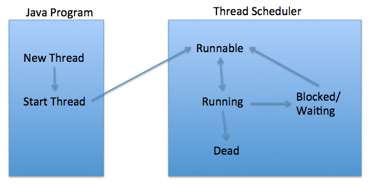

[Core Java Tutorial | DigitalOcean](https://www.digitalocean.com/community/tutorials/core-java-tutorial)

# Thread

Process: A process is a self contained execution environment and it can be seen as a program or application.

Thread: lightweight.

* a process can have multiple threads running, and at least one main thread.

* all thread share parent process code and data

* thread creation, context switching, and intercommunication are less expensive

* Multithreading: In multi-core system, more than one thread can run at the exactly same time. In single-core system, more than one thread can run parallel using OS feature time slicing to share the processor time.

## example

* implement `Runnable`: recommended (interface-oriented programming). Support to be more functional class.

* extends `Thread`

```java
// anonymous way
Runnable r = new Runnable(){
            @Override
            public void run() {
                System.out.println("My Runnable");
            }};
// lambda way, since Runnable is a functional interface
Runnable r1 = () -> System.out.println("My Runnable");

// verbose way, especially when the class is complicated, e.g. a publisher/consumer
public class HeavyWorkRunnable implements Runnable {

    @Override
    public void run() {
        System.out.println("Doing heavy processing - START "+Thread.currentThread().getName());
        try {
            Thread.sleep(1000);
            //Get database connection, delete unused data from DB
            doDBProcessing();
        } catch (InterruptedException e) {
            e.printStackTrace();
        }
        System.out.println("Doing heavy processing - END "+Thread.currentThread().getName());
    }

    private void doDBProcessing() throws InterruptedException {
        Thread.sleep(5000);
    }

}


public class MyThread extends Thread {

    public MyThread(String name) {
        super(name);
    }

    @Override
    public void run() {
        System.out.println("MyThread - START "+Thread.currentThread().getName());
        try {
            Thread.sleep(1000);
            doDBProcessing();
        } catch (InterruptedException e) {
            e.printStackTrace();
        }
        System.out.println("MyThread - END "+Thread.currentThread().getName());
    }

    private void doDBProcessing() throws InterruptedException {
        Thread.sleep(5000);
    }

}


public class ThreadRunExample {

    public static void main(String[] args){
        Thread t1 = new Thread(new HeavyWorkRunnable(), "t1");
        Thread t2 = new Thread(new HeavyWorkRunnable(), "t2");
        System.out.println("Starting Runnable threads");
        t1.start();
        t2.start();
        System.out.println("Runnable Threads has been started");
        Thread t3 = new MyThread("t3");
        Thread t4 = new MyThread("t4");
        System.out.println("Starting MyThreads");
        t3.start();
        t4.start();
        System.out.println("MyThreads has been started");

    }
}
```

## daemon threads & non-daemon threads

In Java, a daemon thread is a low-priority thread that runs in the background to perform tasks such as garbage collection and memory management. Daemon threads are usually used to perform tasks that do not require user interaction or direct communication with the user. In Java, you can create a daemon thread by calling the `setDaemon(true)` method on the Thread object.

When the main thread finishes in a Java program, the JVM will only wait for non-daemon threads to complete before terminating. Daemon threads, on the other hand, will be abruptly terminated when the JVM exits, regardless of their state.

### garbage collector daemon thread

If the garbage collector daemon thread is terminated abruptly during the JVM shutdown, it may leave some unreclaimed objects in the heap. The unreclaimed objects will eventually be reclaimed by the operating system when the process terminates.

Calling `System.gc()` does not start a new thread. Instead, it is a request to the JVM to run the garbage collector. Whether or not the JVM actually runs the garbage collector in response to this request is up to the JVM implementation and cannot be guaranteed. 

In general, it is not recommended to call `System.gc()` explicitly. 

In some rare cases, calling `System.gc()` may be necessary. For example, if your application is generating a large amount of garbage and you want to force garbage collection before a critical section of code, you can call `System.gc()` to encourage the JVM to collect the garbage. But note that this is generally not recommended unless you have a specific need for it and have thoroughly tested its impact on performance.

Therefore, it's generally recommended to manage memory explicitly by properly releasing objects when they are no longer needed, rather than relying on the JVM to reclaim them at the end of the process.

## blocked thread (wait, notify...)



Object class contains 3 final methods `wait`, `notify`, `notifyall` which allows thread to communicate about the lock status.

`wait`: block the current thread, until some thread calls `notify`/`notifyall` on this object, or after some specified time.

`notify`: unlock one thread that's waiting for the object

`notifyAll`: unlock all threads that're waiting for the object.

```java
// producer consumer issue

public class WaitNotifyTest {

    public static void main(String[] args) {
        Message msg = new Message("process it");
        Waiter waiter = new Waiter(msg);
        new Thread(waiter,"waiter").start();

        Waiter waiter1 = new Waiter(msg);
        new Thread(waiter1, "waiter1").start();

        Notifier notifier = new Notifier(msg);
        new Thread(notifier, "notifier").start();
// here the line will be printed quickly and the main thread is finished 
// while all the other threads are still running. See thread.join below
        System.out.println("All the threads are started");
    }

}

class Message {
    private String msg;

    public Message(String str){
        this.msg=str;
    }

    public String getMsg() {
        return msg;
    }

    public void setMsg(String str) {
        this.msg=str;
    }
}

class Waiter implements Runnable{

    private Message msg;

    public Waiter(Message m){
        this.msg=m;
    }

    @Override
    public void run() {
        String name = Thread.currentThread().getName();
        synchronized (msg) {
            try{
                System.out.println(name+" waiting to get notified at time:"+System.currentTimeMillis());
                msg.wait();
            }catch(InterruptedException e){
                e.printStackTrace();
            }
            System.out.println(name+" waiter thread got notified at time:"+System.currentTimeMillis());
            //process the message now
            System.out.println(name+" processed: "+msg.getMsg());
        }
    }
}

class Notifier implements Runnable {

    private Message msg;

    public Notifier(Message msg) {
        this.msg = msg;
    }

    @Override
    public void run() {
        String name = Thread.currentThread().getName();
        System.out.println(name+" started");
        try {
            Thread.sleep(10000);
            synchronized (msg) {
                msg.setMsg(name+" Notifier work done");
                msg.notify();
                // msg.notifyAll();
            }
        } catch (InterruptedException e) {
            e.printStackTrace();
        }

    }
}
```

### thread.join

If there are any non-daemon threads still running, they will continue to run even after the `main()` function has completed. The JVM will keep running until all non-daemon threads have finished executing. Once all non-daemon threads have completed, the JVM will exit.

If you want the main process to wait for all threads to complete before exiting, you can call the `join()` method on each thread. The `join()` method will block the calling thread (in this case, the main thread) until the thread being joined completes its execution.

**public final void join()**: This java thread join method puts the current thread on wait until the thread on which it’s called is dead. If the thread is interrupted, it throws InterruptedException. **public final synchronized void join(long millis)**: This java thread join method is used to wait for the thread on which it’s called to be dead or wait for specified milliseconds. Since thread execution depends on OS implementation, it doesn’t guarantee that the current thread will wait only for given time. **public final synchronized void join(long millis, int nanos)**: This java thread join method is used to wait for thread to die for given milliseconds plus nanoseconds.

Using join with maximum time can avoid some dead lock issues.

```java
public class ThreadJoinExample {

    public static void main(String[] args) {
        Thread t1 = new Thread(new MyRunnable(), "t1");
        Thread t2 = new Thread(new MyRunnable(), "t2");
        Thread t3 = new Thread(new MyRunnable(), "t3");

        t1.start();

        //start second thread after waiting for 2 seconds or if it's dead
        try {
            t1.join(2000);
        } catch (InterruptedException e) {
            e.printStackTrace();
        }

        t2.start();

        //start third thread only when first thread is dead
        try {
            t1.join();
        } catch (InterruptedException e) {
            e.printStackTrace();
        }

        t3.start();

        //let all threads finish execution before finishing main thread
        try {
            t1.join();
            t2.join();
            t3.join();
        } catch (InterruptedException e) {
            // TODO Auto-generated catch block
            e.printStackTrace();
        }

        System.out.println("All threads are dead, exiting main thread");
    }

}

class MyRunnable implements Runnable{

    @Override
    public void run() {
        System.out.println("Thread started:::"+Thread.currentThread().getName());
        try {
            Thread.sleep(4000);
        } catch (InterruptedException e) {
            e.printStackTrace();
        }
        System.out.println("Thread ended:::"+Thread.currentThread().getName());
    }

}
```

## Thread safety (synchronized)

Multiple threads create from the same object share the object variables, which may cause issues. To avoid parallel update issues, we can

1. Do not update in the parallel thread

2. Synchronization is the easiest and most widely used tool for thread safety in java.

3. Use of Atomic Wrapper classes from *java.util.concurrent.atomic* package. For example AtomicInteger

4. Use of locks from *java.util.concurrent.locks* package.

5. Using thread safe collection classes, check this post for usage of [ConcurrentHashMap](https://www.digitalocean.com/community/tutorials/concurrenthashmap-in-java) for thread safety.

6. Using volatile keyword with variables to make every thread read the data from memory, not read from thread cache.

`synchronized` internally uses locks on Object or Class to make sure only one thread is executing the synchronized code. A monitor in Java is a synchronization mechanism that allows multiple threads to safely access shared resources. A monitor is associated with an object, and when a thread enters a synchronized block on that object, it acquires the monitor lock.

When use synchronization,

1. use in 2 ways: on entire method or on a code block. Cannot use `synchronized` on construction code or variables.

2. Best practice:
   
   1. use the lowest level of lock. Better lock the required code block instead of the whole method. Lock the instance method in fact use the current Object as the lock, and lock the static method in fact use the current Class as the lock.
   
   2. Use a private dummy object as the lock. Do not make the lock public or provide public setter, because when the object is changed, multiple threads on this variable maybe parallel running for they in fact locked different object reference.
      
      1. Better not use the current Object as a lock. It will lock all the fields on the Object, which may block all the synchronized code on this class when there're many synchronized blocks.
      
      2. Better not use any object maintained in a constant pool, e.g. String. It may block some completely unrelated synchronized code on the same String.

```java
public class ThreadSafety {

    public static void main(String[] args) throws InterruptedException {

        ProcessingThread pt = new ProcessingThread();
        Thread t1 = new Thread(pt, "t1");
        t1.start();
        Thread t2 = new Thread(pt, "t2");
        t2.start();
        //wait for threads to finish processing
        t1.join();
        t2.join();
        System.out.println("Processing count="+pt.getCount());
    }

}

class ProcessingThread implements Runnable{
    private int count;
    private final Object lock = new Object();

    @Override
    public void run() {
        for(int i=1; i < 5; i++){
            processSomething(i);
            synchronized (lock) {
                count++;
            }
        }
    }

    public int getCount() {
        return this.count;
    }

    private void processSomething(int i) {
        // processing some job
        try {
            Thread.sleep(i*1000);
        } catch (InterruptedException e) {
            e.printStackTrace();
        }
    }

}
```

## Dead lock

To avoid dead lock,

1. **Avoid Nested Locks**: This is the most common reason for deadlocks, avoid locking another resource if you already hold one. It’s almost impossible to get deadlock situation if you are working with only one object lock.

2. **Lock Only What is Required**

3. **Avoid waiting indefinitely**: You can get deadlock if two threads are waiting for each other to finish indefinitely using [thread join](https://www.digitalocean.com/community/tutorials/java-thread-join-example "Java Thread Join Example with Explanation"). If your thread has to wait for another thread to finish, it’s always best to use join with maximum time you want to wait for thread to finish.

### thread dump

To detect dead lock, we can use thread dump.

Java thread dump is list of all the thread active in JVM. Each entry is in the following format:

1. **Thread Name**: Name of the Thread
2. **Thread Priority**: Priority of the thread
3. **Thread ID**: Represents the unique ID of the Thread
4. **Thread Status**: Provides the current [thread state](https://www.digitalocean.com/community/tutorials/thread-life-cycle-in-java-thread-states-in-java "Life Cycle of Thread – Understanding Thread States in Java"), for example RUNNABLE, WAITING, BLOCKED. While analyzing deadlock look for the blocked threads and resources on which they are trying to acquire lock.
5. **Thread callstack**: Provides the vital stack information for the thread. This is the place where we can see the locks obtained by Thread and if it’s waiting for any lock.

To get thread dump:

1. **VisualVM Profiler**: If you are analyzing application for slowness, you must use a profiler. We can generate thread dump for any process using VisualVM profiler very easily. You just need to right click on the running process and click on “Thread Dump” option to generate it.

2. **jstack**: Java comes with **jstack** tool through which we can generate thread dump for a java process. This is a two step process.
   
   1. Find out the PID of the java process using `ps -eaf | grep java` command
   2. Run jstack tool as `jstack PID` to generate the thread dump output to console, you can append thread dump output to file using command “`jstack PID >> mydumps.tdump`”

3. We can use `kill -3 PID` command to generate the thread dump. This is slightly different from other ways to generate thread dump. When kill command is issued, thread dump is generated to the System out of the program. So if it’s a java program with console as system out, the thread dump will get printed on the console. If the java program is a Tomcat server with system out as `catalina.out`, then thread dump will be generated in the file.

4. Java 8 has introduced `jcmd` utility. You should use this instead of jstack if you are on Java 8 or higher. Command to generate thread dump using jcmd is `jcmd PID Thread.print`.

### nested dead lock example

```java
public class ThreadDeadlock {

    public static void main(String[] args) throws InterruptedException {
        Object obj1 = new Object();
        Object obj2 = new Object();
        Object obj3 = new Object();

        Thread t1 = new Thread(new SyncThread(obj1, obj2), "t1");
        Thread t2 = new Thread(new SyncThread(obj2, obj3), "t2");
        Thread t3 = new Thread(new SyncThread(obj3, obj1), "t3");

        t1.start();
        Thread.sleep(5000);
        t2.start();
        Thread.sleep(5000);
        t3.start();

    }

}

class SyncThread implements Runnable{
    private Object obj1;
    private Object obj2;

    public SyncThread(Object o1, Object o2){
        this.obj1=o1;
        this.obj2=o2;
    }
    @Override
    public void run() {
        String name = Thread.currentThread().getName();
        System.out.println(name + " acquiring lock on "+obj1);
        synchronized (obj1) {
         System.out.println(name + " acquired lock on "+obj1);
         work();
         System.out.println(name + " acquiring lock on "+obj2);
         synchronized (obj2) {
            System.out.println(name + " acquired lock on "+obj2);
            work();
        }
         System.out.println(name + " released lock on "+obj2);
        }
        System.out.println(name + " released lock on "+obj1);
        System.out.println(name + " finished execution.");
    }
    private void work() {
        try {
            Thread.sleep(30000);
        } catch (InterruptedException e) {
            e.printStackTrace();
        }
    }
}
```

#### thread dump

```shell
2012-12-27 19:08:34
Full thread dump Java HotSpot(TM) 64-Bit Server VM (23.5-b02 mixed mode):

"Attach Listener" daemon prio=5 tid=0x00007fb0a2814000 nid=0x4007 waiting on condition [0x0000000000000000]
   java.lang.Thread.State: RUNNABLE

"DestroyJavaVM" prio=5 tid=0x00007fb0a2801000 nid=0x1703 waiting on condition [0x0000000000000000]
   java.lang.Thread.State: RUNNABLE

"t3" prio=5 tid=0x00007fb0a204b000 nid=0x4d07 waiting for monitor entry [0x000000015d971000]
   java.lang.Thread.State: BLOCKED (on object monitor)
    at com.journaldev.threads.SyncThread.run(ThreadDeadlock.java:41)
    - waiting to lock <0x000000013df2f658> (a java.lang.Object)
    - locked <0x000000013df2f678> (a java.lang.Object)
    at java.lang.Thread.run(Thread.java:722)

"t2" prio=5 tid=0x00007fb0a1073000 nid=0x4207 waiting for monitor entry [0x000000015d209000]
   java.lang.Thread.State: BLOCKED (on object monitor)
    at com.journaldev.threads.SyncThread.run(ThreadDeadlock.java:41)
    - waiting to lock <0x000000013df2f678> (a java.lang.Object)
    - locked <0x000000013df2f668> (a java.lang.Object)
    at java.lang.Thread.run(Thread.java:722)

"t1" prio=5 tid=0x00007fb0a1072000 nid=0x5503 waiting for monitor entry [0x000000015d86e000]
   java.lang.Thread.State: BLOCKED (on object monitor)
    at com.journaldev.threads.SyncThread.run(ThreadDeadlock.java:41)
    - waiting to lock <0x000000013df2f668> (a java.lang.Object)
    - locked <0x000000013df2f658> (a java.lang.Object)
    at java.lang.Thread.run(Thread.java:722)

"Service Thread" daemon prio=5 tid=0x00007fb0a1038000 nid=0x5303 runnable [0x0000000000000000]
   java.lang.Thread.State: RUNNABLE

"C2 CompilerThread1" daemon prio=5 tid=0x00007fb0a1037000 nid=0x5203 waiting on condition [0x0000000000000000]
   java.lang.Thread.State: RUNNABLE

"C2 CompilerThread0" daemon prio=5 tid=0x00007fb0a1016000 nid=0x5103 waiting on condition [0x0000000000000000]
   java.lang.Thread.State: RUNNABLE

"Signal Dispatcher" daemon prio=5 tid=0x00007fb0a4003000 nid=0x5003 runnable [0x0000000000000000]
   java.lang.Thread.State: RUNNABLE

"Finalizer" daemon prio=5 tid=0x00007fb0a4800000 nid=0x3f03 in Object.wait() [0x000000015d0c0000]
   java.lang.Thread.State: WAITING (on object monitor)
    at java.lang.Object.wait(Native Method)
    - waiting on <0x000000013de75798> (a java.lang.ref.ReferenceQueue$Lock)
    at java.lang.ref.ReferenceQueue.remove(ReferenceQueue.java:135)
    - locked <0x000000013de75798> (a java.lang.ref.ReferenceQueue$Lock)
    at java.lang.ref.ReferenceQueue.remove(ReferenceQueue.java:151)
    at java.lang.ref.Finalizer$FinalizerThread.run(Finalizer.java:177)

"Reference Handler" daemon prio=5 tid=0x00007fb0a4002000 nid=0x3e03 in Object.wait() [0x000000015cfbd000]
   java.lang.Thread.State: WAITING (on object monitor)
    at java.lang.Object.wait(Native Method)
    - waiting on <0x000000013de75320> (a java.lang.ref.Reference$Lock)
    at java.lang.Object.wait(Object.java:503)
    at java.lang.ref.Reference$ReferenceHandler.run(Reference.java:133)
    - locked <0x000000013de75320> (a java.lang.ref.Reference$Lock)

"VM Thread" prio=5 tid=0x00007fb0a2049800 nid=0x3d03 runnable 

"GC task thread#0 (ParallelGC)" prio=5 tid=0x00007fb0a300d800 nid=0x3503 runnable 

"GC task thread#1 (ParallelGC)" prio=5 tid=0x00007fb0a2001800 nid=0x3603 runnable 

"GC task thread#2 (ParallelGC)" prio=5 tid=0x00007fb0a2003800 nid=0x3703 runnable 

"GC task thread#3 (ParallelGC)" prio=5 tid=0x00007fb0a2004000 nid=0x3803 runnable 

"GC task thread#4 (ParallelGC)" prio=5 tid=0x00007fb0a2005000 nid=0x3903 runnable 

"GC task thread#5 (ParallelGC)" prio=5 tid=0x00007fb0a2005800 nid=0x3a03 runnable 

"GC task thread#6 (ParallelGC)" prio=5 tid=0x00007fb0a2006000 nid=0x3b03 runnable 

"GC task thread#7 (ParallelGC)" prio=5 tid=0x00007fb0a2006800 nid=0x3c03 runnable 

"VM Periodic Task Thread" prio=5 tid=0x00007fb0a1015000 nid=0x5403 waiting on condition 

JNI global references: 114


Found one Java-level deadlock:
=============================
"t3":
  waiting to lock monitor 0x00007fb0a1074b08 (object 0x000000013df2f658, a java.lang.Object),
  which is held by "t1"
"t1":
  waiting to lock monitor 0x00007fb0a1010f08 (object 0x000000013df2f668, a java.lang.Object),
  which is held by "t2"
"t2":
  waiting to lock monitor 0x00007fb0a1012360 (object 0x000000013df2f678, a java.lang.Object),
  which is held by "t3"

Java stack information for the threads listed above:
===================================================
"t3":
    at com.journaldev.threads.SyncThread.run(ThreadDeadlock.java:41)
    - waiting to lock <0x000000013df2f658> (a java.lang.Object)
    - locked <0x000000013df2f678> (a java.lang.Object)
    at java.lang.Thread.run(Thread.java:722)
"t1":
    at com.journaldev.threads.SyncThread.run(ThreadDeadlock.java:41)
    - waiting to lock <0x000000013df2f668> (a java.lang.Object)
    - locked <0x000000013df2f658> (a java.lang.Object)
    at java.lang.Thread.run(Thread.java:722)
"t2":
    at com.journaldev.threads.SyncThread.run(ThreadDeadlock.java:41)
    - waiting to lock <0x000000013df2f678> (a java.lang.Object)
    - locked <0x000000013df2f668> (a java.lang.Object)
    at java.lang.Thread.run(Thread.java:722)

Found 1 deadlock.
```

# ThreadLocal

Java ThreadLocal is used to create thread local variables.

```java
import java.text.SimpleDateFormat;
import java.util.Random;

public class ThreadLocalExample implements Runnable{

    // SimpleDateFormat is not thread-safe, so give one to each thread
    private static final ThreadLocal<SimpleDateFormat> formatter = 
    ThreadLocal.<SimpleDateFormat>withInitial
    (() -> {return new SimpleDateFormat("yyyyMMdd HHmm");});

    public static void main(String[] args) throws InterruptedException {
        ThreadLocalExample obj = new ThreadLocalExample();
        for(int i=0 ; i<10; i++){
            Thread t = new Thread(obj, ""+i);
            Thread.sleep(new Random().nextInt(1000));
            t.start();
        }
    }

    @Override
    public void run() {
        System.out.println("Thread Name= "+Thread.currentThread().getName()+" default Formatter = "+formatter.get().toPattern());
        try {
            Thread.sleep(new Random().nextInt(1000));
        } catch (InterruptedException e) {
            e.printStackTrace();
        }
        //formatter pattern is changed here by thread, but it won't reflect to other threads
        formatter.set(new SimpleDateFormat());

        System.out.println("Thread Name= "+Thread.currentThread().getName()+" formatter = "+formatter.get().toPattern());
    }

}
```

# Callable

Callable is thread that can return things.

```java
public class MyCallable implements Callable<String> {

    @Override
    public String call() throws Exception {
        Thread.sleep(1000);
        return Thread.currentThread().getName();
    }

    public static void main(String args[]){
        //Get ExecutorService from Executors utility class, thread pool size is 10
        ExecutorService executor = Executors.newFixedThreadPool(10);
        //create a list to hold the Future object associated with Callable
        List<Future<String>> list = new ArrayList<Future<String>>();
        //Create MyCallable instance
        Callable<String> callable = new MyCallable();
        for(int i=0; i< 100; i++){
            //submit Callable tasks to be executed by thread pool
            Future<String> future = executor.submit(callable);
            //add Future to the list, we can get return value using Future
            list.add(future);
        }
        for(Future<String> fut : list){
            try {
                //print the return value of Future, notice the output delay in console
                // because Future.get() waits for task to get completed
                System.out.println(new Date()+ "::"+fut.get());
            } catch (InterruptedException | ExecutionException e) {
                e.printStackTrace();
            }
        }
        //shut down the executor service now
        executor.shutdown();
    }

}
```

# Thread Pool Framework

Tread pool is a way to manage the pool of worker threads. It contains a queue that keeps tasks waiting to get executed. There're 3 main classes:

1. [ExecutorService ](https://docs.oracle.com/javase/8/docs/api/java/util/concurrent/ExecutorService.html): the interface of thread pool.

2. [ThreadPoolExecutor ](https://docs.oracle.com/javase/8/docs/api/java/util/concurrent/ThreadPoolExecutor.html): the implemented thread pool, with complex functions.

3. [Executors ](https://docs.oracle.com/javase/8/docs/api/java/util/concurrent/Executors.html): factory class to create all kinds of thread pool

## some executor pools

The work queue size of an `ExecutorService` in Java depends on the type of the work queue implementation used.

If the `ExecutorService` is created using the `Executors.newFixedThreadPool(int nThreads)` method, which creates a fixed-size thread pool, then the work queue size is unbounded. This means that tasks submitted to the thread pool will wait in an unbounded queue until a thread is available to execute them.

If the `ExecutorService` is created using the `Executors.newCachedThreadPool()` method, which creates a thread pool that creates new threads as needed, then the work queue size is also unbounded.

If the `ExecutorService` is created using the `Executors.newSingleThreadExecutor()` method, which creates a single thread executor that executes tasks sequentially in the order they are submitted, and the work queue size is also unbounded. The main difference between `newSingleThreadExecutor()` and `newFixedThreadPool(1)` is the order of execution of submitted tasks. If you need to ensure that tasks are executed in the order they are submitted, you should use `newSingleThreadExecutor()`. If you need to limit the number of concurrent tasks to one but do not care about the order of execution, you can use `newFixedThreadPool(1)`.

**Unbounded work queue size can potentially cause memory issues if the queue grows too large.**

If you want to create an `ExecutorService` with a bounded work queue size, you can use the `ThreadPoolExecutor` class and specify the maximum size of the work queue when creating the thread pool. In the following example, the ThreadPoolExecutor has the initial pool size as 2, maximum pool size to 4 and work queue size as 2. So if there are 4 running tasks and more tasks are submitted, the work queue will hold only 2 of them and the rest of them will be handled by `RejectedExecutionHandlerImpl`.

```java
import java.util.concurrent.ExecutorService;
import java.util.concurrent.Executors;
import java.util.concurrent.ThreadPoolExecutor;
import java.util.concurrent.RejectedExecutionHandler;
import java.util.concurrent.ArrayBlockingQueue;
import java.util.concurrent.ThreadFactory;
import java.util.concurrent.TimeUnit;


public class WorkerPool {

    public static void main(String args[]) throws InterruptedException{
        //RejectedExecutionHandler implementation
        RejectedExecutionHandlerImpl rejectionHandler = new RejectedExecutionHandlerImpl();
        //Get the ThreadFactory implementation to use
        ThreadFactory threadFactory = Executors.defaultThreadFactory();
        //creating the ThreadPoolExecutor with initial pool size as 2, maximum pool size to 4 and work queue size as 2
        ThreadPoolExecutor executorPool = new ThreadPoolExecutor(2, 4, 10, TimeUnit.SECONDS, new ArrayBlockingQueue<Runnable>(2), threadFactory, rejectionHandler);
        //start the monitoring thread
        MyMonitorThread monitor = new MyMonitorThread(executorPool, 3);
        Thread monitorThread = new Thread(monitor);
        monitorThread.start();
        //submit work to the thread pool
        for(int i=0; i<10; i++){
            executorPool.execute(new WorkerThread("cmd"+i));
        }

        Thread.sleep(30000);
        //shut down the pool
        executorPool.shutdown();
        //shut down the monitor thread
        Thread.sleep(5000);
        monitor.shutdown();

    }
}

class WorkerThread implements Runnable {

    private String command;

    public WorkerThread(String s){
        this.command=s;
    }

    @Override
    public void run() {
        System.out.println(Thread.currentThread().getName()+" Start. Command = "+command);
        processCommand();
        System.out.println(Thread.currentThread().getName()+" End.");
    }

    private void processCommand() {
        try {
            Thread.sleep(5000);
        } catch (InterruptedException e) {
            e.printStackTrace();
        }
    }

    @Override
    public String toString(){
        return this.command;
    }

}

class RejectedExecutionHandlerImpl implements RejectedExecutionHandler {

    @Override
    public void rejectedExecution(Runnable r, ThreadPoolExecutor executor) {
        System.out.println(r.toString() + " is rejected");
    }

}

class MyMonitorThread implements Runnable
{
    private ThreadPoolExecutor executor;
    private int seconds;
    private boolean run=true;

    public MyMonitorThread(ThreadPoolExecutor executor, int delay)
    {
        this.executor = executor;
        this.seconds=delay;
    }
    public void shutdown(){
        this.run=false;
    }
    @Override
    public void run()
    {
        while(run){
                System.out.println(
                    String.format("[monitor] [%d/%d] Active: %d, Completed: %d, Task: %d, isShutdown: %s, isTerminated: %s",
                        this.executor.getPoolSize(),
                        this.executor.getCorePoolSize(),
                        this.executor.getActiveCount(),
                        this.executor.getCompletedTaskCount(),
                        this.executor.getTaskCount(),
                        this.executor.isShutdown(),
                        this.executor.isTerminated()));
                try {
                    Thread.sleep(seconds*1000);
                } catch (InterruptedException e) {
                    e.printStackTrace();
                }
        }

    }
}
```

# Timer & TimerTask

**java.util.TimerTask** is an **[abstract class](https://www.digitalocean.com/community/tutorials/abstract-class-in-java)** that implements Runnable interface and we need to extend this class to create our own **TimerTask** that can be scheduled using *java Timer* class.

While scheduling tasks using Timer, you should make sure that time interval is more than normal thread execution, otherwise tasks queue size will keep growing and eventually task will be executing always.

```java
import java.util.Date;
import java.util.Timer;
import java.util.TimerTask;

public class MyTimerTask extends TimerTask {

    @Override
    public void run() {
        System.out.println("Timer task started at:"+new Date());
        completeTask();
        System.out.println("Timer task finished at:"+new Date());
    }

    private void completeTask() {
        try {
            //assuming it takes 20 secs to complete the task
            Thread.sleep(20000);
        } catch (InterruptedException e) {
            e.printStackTrace();
        }
    }

    public static void main(String args[]){
        TimerTask timerTask = new MyTimerTask();
        //running timer task as daemon thread
        Timer timer = new Timer(true);
        //schedule the task every 10 seconds 
        timer.scheduleAtFixedRate(timerTask, 0, 10*1000);
        System.out.println("TimerTask started");
        //cancel after sometime
        try {
            Thread.sleep(120000);
        } catch (InterruptedException e) {
            e.printStackTrace();
        }
        timer.cancel();
        System.out.println("TimerTask cancelled");
        try {
            Thread.sleep(30000);
        } catch (InterruptedException e) {
            e.printStackTrace();
        }
    }

}
```

# Lock

Java 1.5 Concurrency API came up with `java.util.concurrent.locks` package with `Lock` interface and some implementation classes to improve the Object locking mechanism. Some important interfaces and classes in Java Lock API are:

1. **Lock**: This is the base interface for Lock API. It provides all the features of synchronized keyword with additional ways to create different Conditions for locking, providing timeout for thread to wait for lock. Some of the important methods are lock() to acquire the lock, unlock() to release the lock, tryLock() to wait for lock for a certain period of time, newCondition() to create the Condition etc.

2. **Condition**: Condition objects are similar to [Object wait-notify](https://www.digitalocean.com/community/tutorials/java-thread-wait-notify-and-notifyall-example) model with additional feature to create different sets of wait. A Condition object is always created by Lock object. Some of the important methods are await() that is similar to wait() and signal(), signalAll() that is similar to notify() and notifyAll() methods.

3. **ReadWriteLock**: It contains a pair of associated locks, one for read-only operations and another one for writing. The read lock may be held simultaneously by multiple reader threads as long as there are no writer threads. The write lock is exclusive.

4. **ReentrantLock**: This is the most widely used implementation class of Lock interface. This class implements the Lock interface in similar way as synchronized keyword. Apart from Lock interface implementation, ReentrantLock contains some utility methods to get the thread holding the lock, threads waiting to acquire the lock etc. synchronized block are reentrant in nature i.e if a thread has lock on the monitor object and if another synchronized block requires to have the lock on the same monitor object then thread can enter that code block. I think this is the reason for the class name to be ReentrantLock. 

```java
import java.util.concurrent.TimeUnit;
import java.util.concurrent.locks.Lock;
import java.util.concurrent.locks.ReentrantLock;

public class ConcurrencyLockExample implements Runnable{

    private Resource resource;
    private Lock lock;

    public ConcurrencyLockExample(Resource r){
        this.resource = r;
        this.lock = new ReentrantLock();
    }

    @Override
    public void run() {
        try {
            lockAcquired = lock.tryLock(10, TimeUnit.SECONDS)
            if(lockAcquired){
                resource.doSomething();
            }
        } catch (InterruptedException e) {
            e.printStackTrace();
        }finally{
            //release lock
            if(lockAcquired) {
                lock.unlock();    
            }
        }
        resource.doLogging();
    }

}

class Resource {

    public void doSomething(){
        //do some operation, DB read, write etc
    }

    public void doLogging(){
        //logging, no need for thread safety
    }
}
```

## lock vs synchronized

1. Use `synchronized` if the code section you want to lock is simple and doesn't need to perform any complex operations. `synchronized` is simpler and more readable than `Lock`.

2. Use `Lock` if you need more advanced features, such as fairness, re-entrancy, and the ability to try acquiring a lock without blocking. `Lock` is more flexible and can provide better performance than `synchronized` in some situations.

3. Always use the `try-finally` pattern when using `Lock` to ensure that the lock is released even if an exception is thrown.

In summary, `synchronized` is easier to use and sufficient for most cases, while `Lock` provides more advanced features and better performance in certain situations. `Lock` provides more control and flexibility, but requires more code and is more error-prone, while `synchronized` is simpler and easier to use, but may have more contention issues in high concurrency scenarios.
